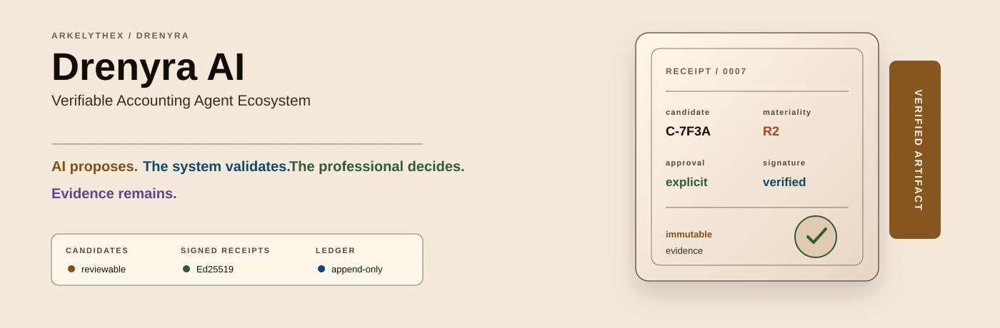
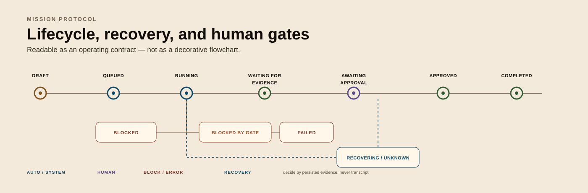
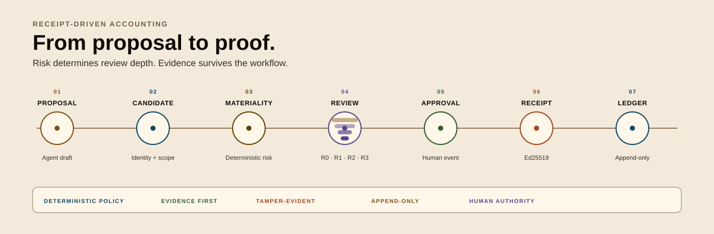
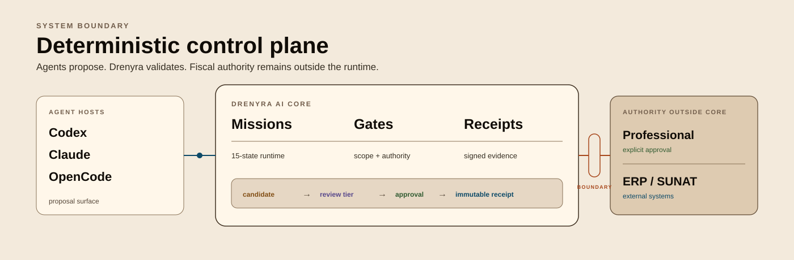

<div align="center">



<p><code>request → policy/evidence verification → immutable receipt</code></p>

<h1>Drenyra AI</h1>

<p><strong>Verifiable Accounting Agent Ecosystem</strong> — the runtime and CLI that make AI execution verifiable, receipted, and risk-proportional for fiscal work.</p>

<p>
<a href="https://www.npmjs.com/package/drenyra-ai"></a>
<a href="https://github.com/arkelythex/drenyra-ai/actions/workflows/ci.yml"></a>


</p>

</div>

---

> [!IMPORTANT]
> **Current stable release: [`v0.5.0`](https://www.npmjs.com/package/drenyra-ai) (npm `@latest`).** All six contracts are **FROZEN**: `mission-protocol`, `candidate`, `receipt`, `gate`, `ledger`, `recovery`. The frozen surface is normative — any breaking change to a frozen contract requires a major version bump and a migration path. `@latest` is the stable channel; use `@main` (or the repository) only for unreleased development. See the [CHANGELOG](CHANGELOG.md) and [RELEASING](RELEASING.md) for the version policy.

<!-- -->

> [!IMPORTANT]
> **Public source repository (open-core intention)** — this repository is
> **publicly visible** on GitHub as part of the Drenyra open-core transition
> intention (charter §9: intention, not contractual promise); distribution of
> artifacts (packages, releases) and commercial services is contractual, never
> public. Use, copy, and distribution of source remain governed by the
> [LICENSE](LICENSE) (proprietary, © Arkelythex).

---

## What It Does

Drenyra AI is **not** an ERP, a ledger of record, a UI, or the fiscal authority — and it is not "an agent that does accounting." It is the **infrastructure that makes AI participation in accounting processes provable**: a configurator, runtime, and control plane that lets any agent propose work over your ERP, ledger, and approval workflow without ever becoming the fiscal authority. It works **standalone** — no Drenyra dependency — so ERPs, accounting SaaS, and agent hosts (Codex, Claude Code, OpenCode) can adopt it directly.

**Before**: "The agent suggested a journal correction and a monthly close. I don't know what was executed, by whom, whether anyone approved it, or whether the numbers were ever touched."

**After**: Every proposal an agent makes becomes a first-class *candidate* with content-derived identity and materiality; every material action produces an immutable, Ed25519-signed *receipt*; every lifecycle transition runs a *gate*; review depth scales with risk instead of hope. Agents propose; the deterministic core decides; the ledger is an append-only hash chain you can validate with one command.

### What it provides

| Capability | What you get |
| --- | --- |
| **Receipt-Driven Accounting (RDA)** | Every material action produces an immutable receipt; nothing material happens without one |
| **Accounting Candidates** | Agent proposals as first-class, reviewable artifacts with content-derived identity and materiality |
| **Proportional review** | Review depth scales with risk — R0 high autonomy → R3 explicit dual approval |
| **Missions** | Protocol-driven, resumable work units with 15 canonical states, commands, and events |
| **Ledger** | Append-only, verifiable audit ledger core with an Ed25519-signed hash chain |
| **Gates** | Lifecycle gates that validate authority, scope, and receipts before any mutation |
| **Approvals** | Human approval as an explicit, recorded event — never implied |
| **Recovery** | Crash-safe resumption of missions and candidates, decided by evidence, never transcript |
| **Tenant isolation** | RUC/company/period scoping enforced in every query and mutation |
| **CLI** | `drenyra-ai` command surface for mission, receipt, ledger, candidate, and gate operations |
| **MCP server** | JSON-RPC 2.0 server (`drenyra-ai mcp serve`) so agent hosts consume the same surface |

---

## The Frontier

Drenyra AI occupies the accounting-domain position that Gentle-AI holds in software engineering — **equivalent discipline, stricter controls**. Gentle-AI turns generic coding agents into a disciplined engineering system; Drenyra AI turns generic agents into a verifiable accounting and fiscal system. The added strictness is deliberate: fiscal risk is not a merge conflict.

> **The institutional thesis: the AI proposes, the system validates, the professional decides, the evidence remains.** The professional never learns to operate an agent orchestration — they ask for an accounting result and receive reviewable candidates, evidence, explicit decisions, and verifiable receipts. See [Intended Usage](docs/intended-usage.md) for the full philosophy.

| Gentle-AI | Equivalent in Drenyra AI |
| --- | --- |
| Configures agent runtimes | Configures accounting/fiscal agent runtimes (`drenyra-ai install run`) |
| Installer and TUI | Installer/configurator (`drenyra-ai install run`) |
| SDD | Accounting missions and fiscal specifications |
| RDD (Receipt-Driven Development) | RDA (Receipt-Driven Accounting) |
| Code candidate | Posting, reconciliation, or declaration candidate |
| Review receipt | Accounting/fiscal receipt (Ed25519, canonical vectors) |
| Pre-commit/push/PR gates | Gates before posting, approving, declaring, or filing |
| Engram memory | Drenyra Engram — informs, never authorizes |
| Skills registry | Drenyra Skills — versioned accounting/tax knowledge |
| doctor / sync / upgrade / rollback | `drenyra-ai doctor run` / `sync run` / `upgrade run` / `rollback run` |

**What Drenyra AI is:** protocols, missions, agents, candidates, gates, receipts, and ledger.

**What Drenyra AI is not:** the ERP, the UI, the ledger of record, or the fiscal authority. See [Intended Usage](docs/intended-usage.md) for the full frontier and the responsibility split.

**Delivery (v1.0):** Drenyra AI ships as a **headless core** consumed by Drenyra Command Center via library, CLI, or MCP; the flagship flow is the **monthly accounting and tax close**. Gentle-AI disappears behind the developer's flow — Drenyra AI disappears behind the professional accountant's flow.

---

## Quick Start

> [!TIP]
> For a five-minute start with prerequisites and install options, see the [Quickstart](docs/quickstart.md); for the full CLI reference, see [Usage](docs/usage.md).

### Install

```bash
npm install drenyra-ai
```

The package ships a prebuilt ESM artifact (`dist/`, Node >= 22), a `drenyra-ai` binary, and library subpaths for each subsystem. Library modules use `node:crypto` only; the CLI adds `ajv` for schema validation.

For a machine-wide binary (global install), use `npm install -g drenyra-ai` — the `drenyra-ai` command then works from any directory.

### Configure the ecosystem (optional)

Once installed, run these to register the accounting/fiscal agent runtime:

| Command | What it does | When to re-run |
| --- | --- | --- |
| `drenyra-ai install run` | Detects agent hosts, writes markers and managed skills assets | First time in a new environment, or after changing hosts |
| `drenyra-ai sync run` | Refresh managed assets, preserving foreign changes | After upgrading the package |
| `drenyra-ai doctor run` | Read-only health check of the ecosystem | Any time something looks wrong |

These are **not required** for the core CLI — missions, receipts, and the ledger work standalone. They configure the ecosystem surface (skills, host markers, memory wiring).

### The CLI

```bash
drenyra-ai --help
```

| Command | What it does |
| --- | --- |
| `drenyra-ai receipt verify <receipt.json> [--keys <keys.json>]` | Verify a signed receipt bundle (hash + Ed25519 signature + trusted signer) |
| `drenyra-ai ledger validate <ledger.json>` | Validate an append-only audit ledger hash chain |
| `drenyra-ai mission start <create-command.json> [--store <file>]` | Create a new mission (DRAFT) |
| `drenyra-ai mission apply <command.json> [--store <file>]` | Apply an execute/approve/reject/reconcile command (real intent handlers by default) |
| `drenyra-ai mission status <missionId> [--store <file>]` | Show a mission snapshot and its event log |
| `drenyra-ai mission recover [--store <file>]` | Crash-safe recovery: mark in-flight RUNNING missions UNKNOWN (idempotent) |
| `drenyra-ai candidate inspect <candidate.json>` | Derive candidate identity + materiality from an inspect file |
| `drenyra-ai candidate verify <candidate.json> --subject <subject-file>` | Revalidate candidate identity against the exact subject bytes |
| `drenyra-ai gate check <gate-input.json>` | Run the standard gates (mission, receipt, approval) over a gate input |
| `drenyra-ai capabilities show` | Declare available contracts, skills, jurisdictions, and adapters |
| `drenyra-ai mcp serve` | Serve the JSON-RPC 2.0 MCP surface over stdio |

Exit codes: `0` success, `1` business error (JSON error to stdout), `2` usage/IO. JSON goes to stdout; the human-readable one-line summary goes to stderr.

#### Audit log

The CLI emits a structured audit log (JSONL — one JSON object per line) for operational events: `mission.started`, `mission.applied`, `mission.apply_failed`, `mission.status_read`, `mission.status_not_found`. Every event always carries the tenant-boundary fields `mission_id`, `ruc`, `period`, `user_id` (fail-closed to `unknown` when the context has no value), plus `level`, `event`, `message`, `timestamp` and optional `details`. The stream is filterable with `jq`, e.g. `jq 'select(.ruc == "20123456789" and .period == "202507")'`.

| Variable | Default | Effect |
| --- | --- | --- |
| `DRENYRA_AUDIT_LOG` | unset | When set to a path, audit lines append to that file; otherwise they go to stderr (stdout stays reserved for command JSON results) |
| `DRENYRA_AUDIT_LEVEL` | `info` | Severity filter — one of `debug`, `info`, `warn`, `error`; events below the level are dropped |

### A minimal session

```bash
# 1. Start a monthly-close mission
drenyra-ai mission start mission-create.json

# 2. Apply an execute command — the intent handler stages work and pauses at the gate
drenyra-ai mission apply mission-command.json

# 3. Show where it stands
drenyra-ai mission status <missionId>

# 4. Verify any receipt and validate the ledger
drenyra-ai receipt verify receipt.json
drenyra-ai ledger validate ledger.json
```

### The target experience

After installation, a professional accountant should be able to say:

> "I use Codex, Claude, or OpenCode — but Drenyra gives them accounting memory, skills, missions, materiality controls, approvals, and verifiable evidence."

```bash
drenyra-ai install run       # configure the accounting/fiscal agent runtime
drenyra-ai doctor run        # read-only health check of the ecosystem
drenyra-ai mission start monthly-close
drenyra-ai candidate inspect correction.json
drenyra-ai gate check posting.json
drenyra-ai receipt verify receipt.json
drenyra-ai ledger validate ledger.json
```

---

## Core Workflow

1. **Install.** Add the package, then use the CLI (or the Drenyra Pi harness) as the runtime.
2. **Start a mission.** A mission is a protocol-driven work unit — `monthly-close`, `correction`, `reconciliation`, `invoice-review`, `compliance-check` — with a frozen lifecycle of 15 canonical states.
3. **Agents stage work; the core decides.** Deterministic `IntentHandler`s stage work and request evidence. Agents never claim SUNAT, bank, or ERP execution and never perform fiscal approval.
4. **Review the candidate.** Review depth is derived from materiality — R0/R1 run autonomously, R2 needs single human approval, R3 needs two distinct approvers. One correction budget, then it is what it is.
5. **Gate the transition.** `mission-state`, `receipt`, and `approval` gates validate authority, scope, and receipts before anything moves.
6. **Receipt everything.** Every material action lands in the append-only ledger. Validate it anytime: `drenyra-ai ledger validate`.

### The mission lifecycle at a glance



Recovery is explicit: in-flight `RUNNING` missions become `UNKNOWN` and resume by **deciding from persisted evidence**, replaying the event log from the last event — never from a transcript. Human-wait states (`WAITING_FOR_EVIDENCE`, `BLOCKED_BY_GATE`, approval) are never auto-recovered.

### Receipt-Driven Accounting at a glance



---

## Contracts — the frozen public surface

Contracts are the **public surface** of Drenyra AI: transport-agnostic, versioned, and consumed by Drenyra, Drenyra Pi, ERPs, other SaaS, and agent hosts. Each frozen contract is pinned by a conformance suite that runs in CI and fails on drift.

| Contract | Version | Status | Consumed by |
| --- | --- | --- | --- |
| [mission-protocol](contracts/mission-protocol.md) | 0.1 | FROZEN | Drenyra, Drenyra Pi, CLI |
| [candidate](contracts/candidate.md) | 0.1 | FROZEN | Drenyra, Drenyra Pi, review tooling |
| [receipt](contracts/receipt.md) | 0.1 | FROZEN | All consumers, ERPs, auditors |
| [gate](contracts/gate.md) | 0.1 | FROZEN | Drenyra, Drenyra Pi, CI/CD |
| [ledger](contracts/ledger.md) | 0.1 | FROZEN | Auditors, ERPs, Drenyra Pi |
| [recovery](contracts/recovery.md) | 0.1 | FROZEN | Drenyra Pi, CLI |
| [brand-system](contracts/brand-system.md) | 0.3 | DRAFT | Drenyra, Drenyra Pi, Drenyra Engram, Guardian Angel, docs |

**Contract requirements:** versioned · verifiable (canonical vectors + conformance suite) · scope-safe (RUC/company/period where fiscal context applies) · transport-agnostic (no HTTP/CLI/framework bindings) · backward-compatible by default (breaking changes require a major bump and a migration path).

---

## Key Features You Should Know About

### Receipt-Driven Accounting (RDA)

Every material action produces an immutable receipt: content-derived hash, Ed25519 signature, and a trusted-signer verification chain. Receipt verification returns a canonical result shape with a precedence-ordered status chain, and tamper detection is pinned by frozen conformance vectors. Nothing material happens without a receipt — this is the RED (Receipt-Driven Execution) primitive of the ecosystem.

### Audit ledger

An append-only, verifiable ledger: commits are atomic accounting changes, and the hash chain is validated by `ledger validate` with a first-divergence report. Missing signer material **fails closed** — an undefined signature yields a violation, never a `TypeError`.

### Missions and the runtime

The `MissionRuntime` is a durable state machine with idempotency replay, optimistic concurrency, and recovery. Fifteen canonical states, a full `VALID_TRANSITIONS` table, a 30-code error taxonomy, 12 event types, and 5 intents (`monthly-close`, `correction`, `reconciliation`, `invoice-review`, `compliance-check`) — all pinned by the `mission-protocol` conformance suite.

### Candidates and proportional review

Agent proposals are first-class artifacts with content-derived identity (mutated subject → rejection), scope, and materiality. Review depth is derived from materiality — never chosen ad hoc — with a full policy matrix (BigInt thresholds, jurisdiction escalation, R3 ceiling) and a **one-correction budget** per candidate.

### Gates, not faith

Lifecycle transitions validate authority, scope, and receipts before any mutation. The `GateRunner` is fail-closed and returns `needs_input` envelopes: approval tiers (R2 single / R3 dual distinct approvers), receipt fail-closed on signer trust, and mission-state legality with a terminal guard. The **AuthorizationGate** wires a standalone RBAC engine into the approval pipeline — per-approver `close:approve` at exact tenant scope.

### Crash-safe recovery

Per-state recovery policy: `RUNNING`/`RETRYING` recover; `UNKNOWN` is decided by evidence; human-wait states are never auto-recovered by the default policy; terminal states are untouched. Recovery replays the event log from the last persisted event and is idempotent.

### Deterministic fiscal engines

The monthly close runs on deterministic engines — `bank-reconciliation/` (canonical normalization, reference-first matching, fail-closed adjustment drafts) and `close-calculations/` (fixed-asset depreciation, provisions, provisional ISR, closing entries to PCGE 59) — wired into the close vertical with skills (`pe.conciliacion-bancaria`, `pe.isr-mensual`, `pe.cierre-resultados`, …). Fiscal convention throughout: **money is BigInt cents, never floats**.

### Tenant isolation

RUC/company/period scope is enforced in every query and mutation — never access data across RUCs without explicit context. `tenant-core` and `tenant-isolation` are shipped as library subpaths.

---

## Hybrid orchestration vs. Drenyra Core

Drenyra AI orchestrates specialized accounting/fiscal agents through `agents/`: deterministic `IntentHandler` implementations for every mission intent stage work, request evidence, and pause at the evidence or approval gate. The deterministic Core — `missions/` (lifecycle, idempotency, rules), `gates/`, `receipts/`, and explicit human approval — remains the authority for what may actually change.

> **Agents never claim SUNAT, bank, or ERP execution and never perform fiscal approval. They only propose and stage work.**



### Layout

```text
cmd/                CLI dispatcher and command adapters
contracts/          Canonical contracts (protocol, candidate, receipt, gate, ledger, recovery)
agents/             Agent orchestration: deterministic intent handlers + registry (stages work only)
missions/           Mission protocol + MissionRuntime (lifecycle, idempotency, events)
candidates/         Candidate identity and materiality
review/             Proportional review lenses and workload forecasting
receipts/           Receipt schemas and verification
ledger/             Audit ledger core
gates/              Lifecycle gates
recovery/           Crash recovery and resumption
tenant-core/        RUC/company/period scope primitives
tenant-isolation/   Tenant isolation enforcement
docs/               Architecture, trust-model, and dependency documentation
```

---

## Consumers

| Consumer | How it uses Drenyra AI |
| --- | --- |
| Drenyra | Fiscal workflows, reviews, approvals |
| Drenyra Pi | Pinned package-local runtime (never `PATH`) |
| CLI | Direct `drenyra-ai` commands |
| External ERPs | Receipt verification, ledger validation |
| Other SaaS | Candidates and gates via contracts |
| Agent hosts | Codex, Claude Code, OpenCode integrations |

## Ecosystem

| Project | Role | Status |
| --- | --- | --- |
| [Drenyra Command Center](https://github.com/arkelythex/drenyra-command-center) | Command Center — web application (consumes) | In development (public) |
| [Drenyra Pi](https://github.com/arkelythex/drenyra-pi) | Pi-native harness (consumes, pinned) | Pre-alpha (public) |
| [Drenyra Engram](https://github.com/arkelythex/drenyra-engram) | Institutional accounting memory (used — informs, never authorizes) | In development (public, Apache-2.0) |
| [Drenyra Skills](https://github.com/arkelythex/drenyra-skills) | Versioned accounting, tax, and operational knowledge | In development (public) |
| [Drenyra Guardian Angel](https://github.com/arkelythex/drenyra-guardian-angel) | Independent, adversarial, continuous verification | In development (public) |

**Direction rule:** Drenyra AI may integrate Drenyra Engram and is consumed by Drenyra and Drenyra Pi. It never depends on Drenyra or Drenyra Pi, and Drenyra Pi never leaks into Drenyra AI's contracts. External systems — ERP, SUNAT, banks — connect through adapters and evidence, never through privileged access.

### Drenyra Dominion Program

Drenyra AI is the **authority core** of the [Drenyra Dominion Program](openspec/programs/drenyra-dominion/README.md), the federated program master that fixes vision, authority, contracts, dependencies, gates, and sequencing across every Drenyra repository. A single master SDD is complemented by implementable vertical SDDs: each vertical delivers a complete capability that may traverse the repositories it needs (for example, the monthly close spans this repo, Drenyra Pi, and Drenyra Command Center) while every repository keeps its ownership and boundaries.

| SDD | Role in this repository |
| --- | --- |
| [SDD-000](openspec/programs/drenyra-dominion/sdds/sdd-000-dominion/README.md) | North Star, frontiers, authority, taxonomy, and domain criteria |
| [SDD-010](openspec/programs/drenyra-dominion/sdds/sdd-010-contracts/README.md) | Ecosystem contracts and release train — multi-repo compatibility and coordinated releases |
| [SDD-030](openspec/programs/drenyra-dominion/sdds/sdd-030-routing/README.md) | Organic accounting work routing from evidence and risk |
| [SDD-040](openspec/programs/drenyra-dominion/sdds/sdd-040-rda-v2/README.md) | Receipt-Driven Accounting v2 — frozen candidates, proportional review, bounded correction |
| [SDD-090](openspec/programs/drenyra-dominion/sdds/sdd-090-guardian/README.md) | Independent, adversarial, strictly read-only verification |

This repository holds only its local change plus a reference to the master program — full specs are never copied here, because they would diverge. The [program README](openspec/programs/drenyra-dominion/README.md) is the source of truth.

---

## Documentation

| Your task | Start here |
| --- | --- |
| Get running in five minutes | [Quickstart](docs/quickstart.md) |
| Full CLI reference and mission store | [Usage](docs/usage.md) |
| Understand the intended usage and the frozen frontier | [Intended Usage](docs/intended-usage.md) |
| Integrate via the public library surface | [SDK](docs/sdk.md) |
| Navigate the codebase as a maintainer | [Codebase Guide](docs/CODEBASE-GUIDE.md) |
| Understand how fiscal correctness is proven | [Deterministic Testing](docs/testing-deterministic.md) |
| Understand open-core governance and contribution rules | [Governance](docs/governance.md), [CONTRIBUTING](CONTRIBUTING.md), [AI Policy](AI_POLICY.md) |
| Read the frozen design series (frontier, monthly close, agents/skills, persistence, v1.0) | [Design 01](docs/design/design-01-ecosystem-frontier-and-authority.md) → [Design 05](docs/design/design-05-testing-releases-v1.md) |
| Understand the trust model | [Trust Model](docs/architecture/trust-model.md) |
| See the system and its boundaries | [System Context](docs/architecture/system-context.md), [Trust Boundaries](docs/architecture/trust-boundaries.md) |
| Understand receipts vs. ledger entries | [Receipt vs. Ledger Entry](docs/architecture/receipt-ledger-model.md) |
| Understand authority and approval | [Authority Model](docs/architecture/authority-model.md) |
| Understand dependency direction | [Dependency Direction](docs/architecture/dependency-direction.md), [Dependency Rules](docs/architecture/dependency-rules.md) |
| Integrate the ecosystem | [Ecosystem Integration](docs/architecture/ecosystem-integration.md), [Ecosystem Boundaries](docs/architecture/ecosystem-boundaries.md) |
| Storage and persistence | [Storage Model](docs/architecture/storage-model.md) |
| Change or extend a contract | [Contracts](contracts/README.md) — change policy, conformance suites, migration path |
| Track the plan | [ROADMAP](ROADMAP.md) and [CHANGELOG](CHANGELOG.md) |
| Read the ecosystem program (master SDD, waves, gates, program-lock) | [Drenyra Dominion Program](openspec/programs/drenyra-dominion/README.md) — program source of truth |
| Contribute | [CONTRIBUTING](CONTRIBUTING.md), [AI Policy](AI_POLICY.md), [CODE_OF_CONDUCT](CODE_OF_CONDUCT.md), [SECURITY](SECURITY.md), [CONTRIBUTORS](CONTRIBUTORS.md) |

---

## Next Steps

- **New to the ecosystem?** Read the [Trust Model](docs/architecture/trust-model.md) first — it explains what the runtime can prove and what it cannot.
- **Just installed?** Run the [Quickstart](docs/quickstart.md), then read the [Intended Usage](docs/intended-usage.md) for the mental model.
- **Integrating an ERP or SaaS?** Start with the [Contracts](contracts/README.md) — they are the public, frozen surface.
- **Building on the runtime?** Read the [Architecture](docs/architecture.md) and the [Layer Model](docs/architecture.md#layer-model), and the [Codebase Guide](docs/CODEBASE-GUIDE.md) for where changes belong.
- **Maintaining Drenyra AI?** Use the [Codebase Guide](docs/CODEBASE-GUIDE.md) to find ownership, and [Deterministic Testing](docs/testing-deterministic.md) to verify a change.
- **Contributing?** Read [CONTRIBUTING](CONTRIBUTING.md) and the [AI Policy](AI_POLICY.md), then pick up an item from the [ROADMAP](ROADMAP.md).

---

<div align="center">
<a href="LICENSE"></a>
</div>

Proprietary. © 2026 Arkelythex. All rights reserved. See [LICENSE](LICENSE).
