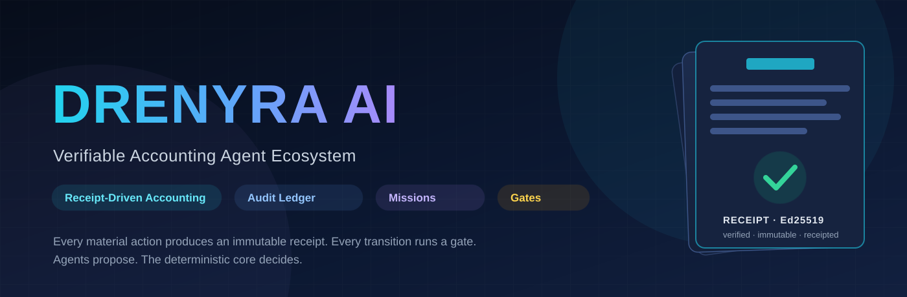
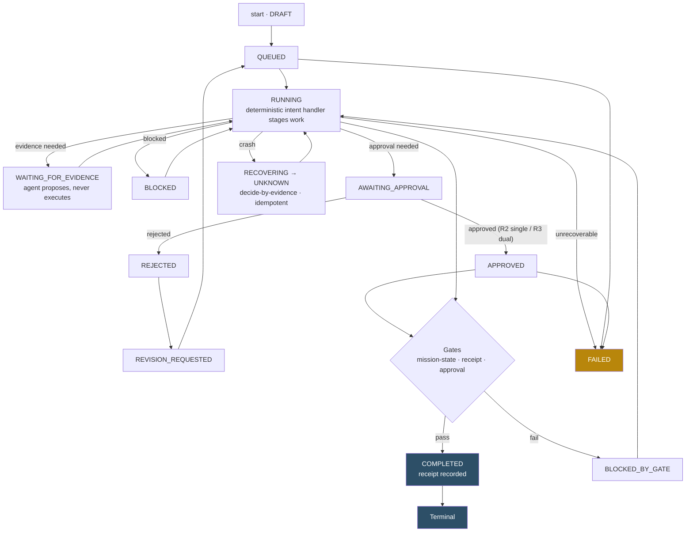
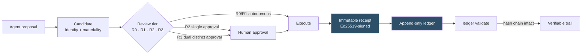

<div align="center">



<h1>Drenyra AI</h1>

<p><strong>Verifiable Accounting Agent Ecosystem</strong> — the runtime and CLI that make AI execution verifiable, receipted, and risk-proportional for fiscal work.</p>

<p>
<a href="https://github.com/arkelythex/drenyra-ai/releases"></a>


</p>

</div>

---

> [!IMPORTANT]
> **Public repository, proprietary license** — this repository is **public** for
> adoption and auditability: the source is visible, but use, copy, and
> distribution remain governed by the [LICENSE](LICENSE) (proprietary,
> © Arkelythex). Public visibility grants read access only; distribution rights
> stay contractual.

<!-- -->

> [!IMPORTANT]
> **v0.2.0 released (2026-08-02)** — all six contracts are **FROZEN**: `mission-protocol`, `candidate`, `receipt`, `gate`, `ledger`, `recovery`. The frozen surface is normative: any change to a frozen contract requires a major version bump. See the [release](https://github.com/arkelythex/drenyra-ai/releases/tag/v0.2.0) and the [CHANGELOG](CHANGELOG.md).

## What It Does

Drenyra AI is the direct accounting-domain counterpart of `gentle-ai`. It does **not** replace your ERP, ledger, or approval workflow — it makes the AI agents you already run over them **provable**. Every proposal an agent makes becomes a first-class *candidate* with identity and materiality; every material action produces an immutable, Ed25519-signed *receipt*; every lifecycle transition runs a *gate*; review depth scales with risk instead of hope.

**Before**: "The agent suggested a journal correction and a monthly close. I don't know what was executed, by whom, whether anyone approved it, or whether the numbers were ever touched."

**After**: Every candidate is reviewed before it can act, every material action is receipted, every transition is gated, and the ledger is an append-only hash chain you can validate with one command. Agents propose; the deterministic core decides.

It works **standalone** — no Drenyra dependency — so ERPs, other accounting SaaS, and agent hosts (Codex, Claude Code, OpenCode) can adopt it.

### What it provides

| Capability | What you get |
| --- | --- |
| **Receipt-Driven Accounting (RDA)** | Every material action produces an immutable receipt; nothing material happens without one |
| **Accounting Candidates** | Agent proposals as first-class, reviewable artifacts with content-derived identity and materiality |
| **Proportional review** | Review depth scales with risk — R0 high autonomy → R3 explicit dual approval |
| **Missions** | Protocol-driven, resumable work units with 15 canonical states, commands, and events |
| **Ledger** | Append-only, verifiable audit ledger core with an Ed25519-signed hash chain |
| **Gates** | Lifecycle gates that validate authority, scope, and receipts before commit/push/PR/release |
| **Approvals** | Human approval as an explicit, recorded event — never implied |
| **Recovery** | Crash-safe resumption of missions and candidates, decided by evidence, never transcript |
| **Tenant isolation** | RUC/company/period scoping enforced in every query and mutation |
| **CLI** | `drenyra-ai` command surface for mission, receipt, ledger, candidate, and gate operations |

---

## Core Workflow

1. **Install.** Add the package, then use the CLI (or the Drenyra Pi harness) as the runtime.
2. **Start a mission.** A mission is a protocol-driven work unit — `monthly-close`, `correction`, `reconciliation`, `invoice-review`, `compliance-check` — with a frozen lifecycle of 15 canonical states.
3. **Agents stage work; the core decides.** Deterministic `IntentHandler`s stage work and request evidence. Agents never claim SUNAT, bank, or ERP execution and never perform fiscal approval.
4. **Review the candidate.** Review depth is derived from materiality — R0/R1 run autonomously, R2 needs single human approval, R3 needs two distinct approvers. One correction budget, then it is what it is.
5. **Gate the transition.** `mission-state`, `receipt`, and `approval` gates validate authority, scope, and receipts before anything moves.
6. **Receipt everything.** Every material action lands in the append-only ledger. Validate it anytime: `drenyra-ai ledger validate`.

### The mission lifecycle at a glance



Recovery is explicit: in-flight `RUNNING` missions become `UNKNOWN` and resume by **deciding from persisted evidence**, replaying the event log from the last event — never from a transcript. Human-wait states (`WAITING_FOR_EVIDENCE`, `BLOCKED_BY_GATE`, approval) are never auto-recovered.

### Receipt-Driven Accounting at a glance



---

## Quick Start

### Install

```bash
npm install drenyra-ai
```

The package ships a prebuilt ESM artifact (`dist/`, Node >= 22), a `drenyra-ai` binary, and library subpaths for each subsystem. Library modules use `node:crypto` only; the CLI adds `ajv` for schema validation.

### The CLI

```bash
drenyra-ai --help
```

| Command | What it does |
| --- | --- |
| `drenyra-ai receipt verify <receipt.json> [--keys <keys.json>]` | Verify a signed receipt bundle (hash + Ed25519 signature + trusted signer) |
| `drenyra-ai ledger validate <ledger.json>` | Validate an append-only audit ledger hash chain |
| `drenyra-ai mission start <create-command.json> [--store <file>]` | Create a new mission (DRAFT) |
| `drenyra-ai mission apply <command.json> [--store <file>]` | Apply an execute/approve/reject/reconcile command (real intent handlers by default) |
| `drenyra-ai mission status <missionId> [--store <file>]` | Show a mission snapshot and its event log |
| `drenyra-ai mission recover [--store <file>]` | Crash-safe recovery: mark in-flight RUNNING missions UNKNOWN (idempotent) |
| `drenyra-ai candidate inspect <candidate.json>` | Derive candidate identity + materiality from an inspect file |
| `drenyra-ai candidate verify <candidate.json> --subject <subject-file>` | Revalidate candidate identity against the exact subject bytes |
| `drenyra-ai gate check <gate-input.json>` | Run the standard gates (mission, receipt, approval) over a gate input |

Exit codes: `0` success, `1` business error (JSON error to stdout), `2` usage/IO. JSON goes to stdout; the human-readable one-line summary goes to stderr.

### A minimal session

```bash
# 1. Start a monthly-close mission
drenyra-ai mission start mission-create.json

# 2. Apply an execute command — the intent handler stages work and pauses at the gate
drenyra-ai mission apply mission-command.json

# 3. Show where it stands
drenyra-ai mission status <missionId>

# 4. Verify any receipt and validate the ledger
drenyra-ai receipt verify receipt.json
drenyra-ai ledger validate ledger.json
```

---

## Contracts — the frozen public surface

Contracts are the **public surface** of Drenyra AI: transport-agnostic, versioned, and consumed by Drenyra, Drenyra Pi, ERPs, other SaaS, and agent hosts. Each frozen contract is pinned by a conformance suite that runs in CI and fails on drift.

| Contract | Version | Status | Consumed by |
| --- | --- | --- | --- |
| [mission-protocol](contracts/mission-protocol.md) | 0.1 | FROZEN | Drenyra, Drenyra Pi, CLI |
| [candidate](contracts/candidate.md) | 0.1 | FROZEN | Drenyra, Drenyra Pi, review tooling |
| [receipt](contracts/receipt.md) | 0.1 | FROZEN | All consumers, ERPs, auditors |
| [gate](contracts/gate.md) | 0.1 | FROZEN | Drenyra, Drenyra Pi, CI/CD |
| [ledger](contracts/ledger.md) | 0.1 | FROZEN | Auditors, ERPs, Drenyra Pi |
| [recovery](contracts/recovery.md) | 0.1 | FROZEN | Drenyra Pi, CLI |

**Contract requirements:** versioned · verifiable (canonical vectors + conformance suite) · scope-safe (RUC/company/period where fiscal context applies) · transport-agnostic (no HTTP/CLI/framework bindings) · backward-compatible by default (breaking changes require a major bump and a migration path).

---

## Key Features You Should Know About

### Receipt-Driven Accounting (RDA)

Every material action produces an immutable receipt: content-derived hash, Ed25519 signature, and a trusted-signer verification chain. Receipt verification returns a canonical result shape with a precedence-ordered status chain, and tamper detection is pinned by frozen conformance vectors. Nothing material happens without a receipt — this is the RED (Receipt-Driven Execution) primitive of the ecosystem.

### Audit ledger

An append-only, verifiable ledger: commits are atomic accounting changes, and the hash chain is validated by `ledger validate` with a first-divergence report. Missing signer material **fails closed** — an undefined signature yields a violation, never a `TypeError`.

### Missions and the runtime

The `MissionRuntime` is a durable state machine with idempotency replay, optimistic concurrency, and recovery. Fifteen canonical states, a full `VALID_TRANSITIONS` table, a 30-code error taxonomy, 12 event types, and 5 intents (`monthly-close`, `correction`, `reconciliation`, `invoice-review`, `compliance-check`) — all pinned by the `mission-protocol` conformance suite.

### Candidates and proportional review

Agent proposals are first-class artifacts with content-derived identity (mutated subject → rejection), scope, and materiality. Review depth is derived from materiality — never chosen ad hoc — with a full policy matrix (BigInt thresholds, jurisdiction escalation, R3 ceiling) and a **one-correction budget** per candidate.

### Gates, not faith

Lifecycle transitions validate authority, scope, and receipts before commit/push/PR/release. The `GateRunner` is fail-closed and returns `needs_input` envelopes: approval tiers (R2 single / R3 dual distinct approvers), receipt fail-closed on signer trust, and mission-state legality with a terminal guard.

### Crash-safe recovery

Per-state recovery policy: `RUNNING`/`RETRYING` recover; `UNKNOWN` is decided by evidence; human-wait states are never auto-recovered by the default policy; terminal states are untouched. Recovery replays the event log from the last persisted event and is idempotent.

### Tenant isolation

RUC/company/period scope is enforced in every query and mutation — never access data across RUCs without explicit context. `tenant-core` and `tenant-isolation` are shipped as library subpaths.

---

## Hybrid orchestration vs. Drenyra Core

Drenyra AI orchestrates specialized accounting/fiscal agents through `agents/`: deterministic `IntentHandler` implementations for every mission intent stage work, request evidence, and pause at the evidence or approval gate. The deterministic Core — `missions/` (lifecycle, idempotency, rules), `gates/`, `receipts/`, and explicit human approval — remains the authority for what may actually change.

> **Agents never claim SUNAT, bank, or ERP execution and never perform fiscal approval. They only propose and stage work.**

### Layout

```text
cmd/                CLI dispatcher and command adapters
contracts/          Canonical contracts (protocol, candidate, receipt, gate, ledger, recovery)
agents/             Agent orchestration: deterministic intent handlers + registry (stages work only)
missions/           Mission protocol + MissionRuntime (lifecycle, idempotency, events)
candidates/         Candidate identity and materiality
review/             Proportional review lenses and workload forecasting
receipts/           Receipt schemas and verification
ledger/             Audit ledger core
gates/              Lifecycle gates
recovery/           Crash recovery and resumption
tenant-core/        RUC/company/period scope primitives
tenant-isolation/   Tenant isolation enforcement
docs/               Architecture, trust-model, and dependency documentation
```

---

## Consumers

| Consumer | How it uses Drenyra AI |
| --- | --- |
| Drenyra | Fiscal workflows, reviews, approvals |
| Drenyra Pi | Pinned package-local runtime (never `PATH`) |
| CLI | Direct `drenyra-ai` commands |
| External ERPs | Receipt verification, ledger validation |
| Other SaaS | Candidates and gates via contracts |
| Agent hosts | Codex, Claude Code, OpenCode integrations |

## Ecosystem

| Project | Role |
| --- | --- |
| [Drenyra](https://github.com/arkelythex/Drenyra) | Accounting Command Center (consumes) |
| [Drenyra Pi](https://github.com/arkelythex/drenyra-pi) | Pi-native harness (consumes, pinned) |
| [Drenyra Engram](https://github.com/arkelythex/drenyra-engram) | Institutional accounting memory (used) |

**Direction rule:** Drenyra AI may integrate Drenyra Engram and is consumed by Drenyra and Drenyra Pi. It never depends on Drenyra or Drenyra Pi, and Drenyra Pi never leaks into Drenyra AI's contracts.

---

## Documentation

| Your task | Start here |
| --- | --- |
| Understand the trust model | [Trust Model](docs/architecture/trust-model.md) |
| See the system and its boundaries | [System Context](docs/architecture/system-context.md), [Trust Boundaries](docs/architecture/trust-boundaries.md) |
| Understand receipts vs. ledger entries | [Receipt vs. Ledger Entry](docs/architecture/receipt-ledger-model.md) |
| Understand authority and approval | [Authority Model](docs/architecture/authority-model.md) |
| Understand dependency direction | [Dependency Direction](docs/architecture/dependency-direction.md), [Dependency Rules](docs/architecture/dependency-rules.md) |
| Integrate the ecosystem | [Ecosystem Integration](docs/architecture/ecosystem-integration.md), [Ecosystem Boundaries](docs/architecture/ecosystem-boundaries.md) |
| Storage and persistence | [Storage Model](docs/architecture/storage-model.md) |
| Change or extend a contract | [Contracts](contracts/README.md) — change policy, conformance suites, migration path |
| Track the plan | [ROADMAP](ROADMAP.md) and [CHANGELOG](CHANGELOG.md) |
| Contribute | [CONTRIBUTING](CONTRIBUTING.md), [CODE_OF_CONDUCT](CODE_OF_CONDUCT.md), [SECURITY](SECURITY.md) |

---

## Next Steps

- **New to the ecosystem?** Read the [Trust Model](docs/architecture/trust-model.md) first — it explains what the runtime can prove and what it cannot.
- **Integrating an ERP or SaaS?** Start with the [Contracts](contracts/README.md) — they are the public, frozen surface.
- **Building on the runtime?** Read the [Architecture](docs/architecture.md) and the [Layer Model](docs/architecture.md#layer-model).
- **Contributing?** Read [CONTRIBUTING](CONTRIBUTING.md), then pick up an item from the [ROADMAP](ROADMAP.md).

---

<div align="center">

</div>

Proprietary. © 2026 Arkelythex. All rights reserved. See [LICENSE](LICENSE).
