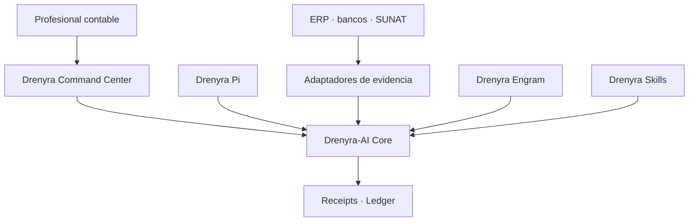

# Ecosystem Boundaries — Drenyra AI (Verifiable Accounting Agent Ecosystem)

> [!IMPORTANT]
> **Drenyra AI is the agent runtime, standalone by design** — no Drenyra dependency — so ERPs, other accounting SaaS, and agent hosts (Codex, Claude Code, OpenCode) can adopt it.

<!-- -->

> **Last updated:** 2026-08-11 (Design 1 — boundary & authority contract). — Part of: [Architecture](../architecture.md)

<!-- -->

> Fiscal convention: monetary values in the Drenyra ecosystem are BigInt cents; no float is ever used for money; version/sequence numbers are JSON integers, never floats.

## In this document

- [Role in the ecosystem](#role-in-the-ecosystem)
- [What Drenyra AI is (in scope)](#what-drenyra-ai-is-in-scope)
- [Explicit non-goals](#explicit-non-goals)
- [What Drenyra AI must NOT contain long-term](#what-drenyra-ai-must-not-contain-long-term)
- [Consumers and producers](#consumers-and-producers)
- [Current state and maturity](#current-state-and-maturity)
- [Ownership and accountability](#ownership-and-accountability)
- [Boundary enforcement](#boundary-enforcement)

## Role in the ecosystem

Drenyra AI is the **agent runtime**: a standalone, verifiable, receipted execution core for fiscal work. It is the direct accounting-domain counterpart of `gentle-ai` — the framework, runtime, agents, skills, receipts, and accounting authority that Drenyra and Drenyra Pi consume.

Drenyra AI works **standalone** — no Drenyra dependency — so ERPs, other accounting SaaS, and agent hosts (Codex, Claude Code, OpenCode) can adopt it.

## What Drenyra AI is (in scope)

- **Receipt-Driven Accounting (RDA)** — every material action produces an immutable receipt; nothing material happens without one.
- **Candidates** — agent proposals as first-class, reviewable artifacts with identity, scope, and materiality.
- **Proportional review** — review depth scales with risk (R0 high autonomy → R3 explicit dual approval).
- **Missions** — protocol-driven, resumable work units with lifecycle, commands, and events.
- **Ledger** — append-only, verifiable, Ed25519-signed audit ledger core.
- **Gates** — lifecycle gates validating authority, scope, and receipts before commit/push/PR/release.
- **Approvals** — human approval as an explicit, recorded event, never implied.
- **CLI** — `drenyra-ai` command surface for mission, receipt, ledger, candidate, and gate operations. (MCP server is roadmap, not implemented.)

## Explicit non-goals

Drenyra AI is **not**:

- The product: no UI, tenants, documents, accounts, or SUNAT flows (that is `arkelythex/Drenyra`).
- A Pi harness: no extension registration, startup panels, or Pi-native commands (that is `arkelythex/drenyra-pi`).
- A memory engine: no observations, scope-first search, relations, or vigencia (that is `arkelythex/drenyra-engram`).

## What Drenyra AI must NOT contain long-term

- **Drenyra product logic** — UI, fiscal app flows, country-pack product surfaces. Extracted and consumed, never re-implemented.
- **Pi harness logic** — Drenyra AI must not even know `drenyra-pi` exists.
- **Memory storage and search** — integrated from `drenyra-engram` when used; memory never authorizes here either.
- **Skill marketplace / registry** — deferred to `arkelythex/drenyra-skills` when it outgrows this repo.

## Ecosystem authority contract (Design 1 — approved boundary)

### Responsibility contract

| Component | Responsibility | Must never |
| --- | --- | --- |
| **Drenyra** | Interface, inboxes, visualization, review and approval | Re-implement gates or mutate authoritative states directly |
| **Drenyra-AI** | Missions, candidates, materiality, authority, gates, receipts, ledger and recovery | Depend on the UI or trust agent narratives |
| **Drenyra Pi** | Harness optimized to run specialized agents | Resolve versions from PATH or bypass the Core |
| **Drenyra Engram** | Institutional memory and context retrieval | Authorize actions or treat memories as evidence |
| **Drenyra Skills** | Versioned accounting, fiscal and jurisdictional knowledge | Silently change frozen policies |
| **Adaptadores** | Gather evidence from ERP, banks, SUNAT and files | Claim success without a verifiable response |
| **Guardian Angel** | Independent and adversarial review | Approve its own work or substitute the professional |

### Chain of authority

1. The professional requests an outcome from Drenyra.
2. Drenyra creates a mission through the published Drenyra-AI contract.
3. Agents research, propose and prepare candidates.
4. Drenyra-AI computes identity, scope and materiality.
5. Gates determine which evidence and approval are required.
6. The professional approves when appropriate.
7. An adapter executes or confirms the external action.
8. Drenyra-AI records the result with a signed receipt and verifiable ledger.
9. Drenyra only represents the authoritative state returned by the Core.

### Dependency rule

- Drenyra and Drenyra Pi consume **published versions** of Drenyra-AI. Drenyra-AI never depends on them.
- The UI may go down and rebuild from Core state; a transcript may be lost and the mission recovered from events and evidence.
- **No consumer may convert a Core rejection into an approval.**

## Consumers and producers

| Direction | Party | Relation |
| --------- | ----- | -------- |
| Consumed by | Drenyra | released, versioned runtime (fiscal workflows, reviews, approvals) |
| Consumed by | Drenyra Pi | pinned, package-local, checksum-verified runtime (never `PATH`) |
| Consumed by | CLI | direct `drenyra-ai` commands |
| Consumed by | External ERPs | receipt verification, ledger validation |
| Consumed by | Other SaaS / agent hosts | candidates and gates via contracts; Codex, Claude Code, OpenCode |
| Integrates | `drenyra-engram` | memory reads/context (optional, memory never authorizes) |

## Current state and maturity

- All six contracts frozen and released; mission runtime, candidates/review, recovery, and gates implemented.
- Hybrid orchestration added: `agents/` stages deterministic intent work; the Core lifecycle, gates, receipts, and human approval remain authoritative.
- MCP server and external ERP/integration surfaces are roadmap, not implemented.
- Consumers must wait for released versions — a checkout is never a dependency.

## Ownership and accountability

- Runtime contracts, receipts, ledger, gates, and review lenses: this repo.
- Product behavior: Drenyra. Pi behavior: `drenyra-pi`. Memory: `drenyra-engram`.
- A defect in a consumed memory surface is filed in `drenyra-engram`; a defect in a runtime contract belongs here.

## Boundary enforcement

- Direction violations are caught in review: a PR that imports Drenyra or Drenyra Pi types into Drenyra AI is rejected.
- Consumers use **released, versioned** artifacts — never a checkout of this repo (see [dependency-direction.md](dependency-direction.md) and [RELEASING.md](../../RELEASING.md)).
- The approved per-component responsibilities and never-musts: [Design 01 — Ecosystem Frontier and Authority](../design/design-01-ecosystem-frontier-and-authority.md).

---

## Read next

- [Ecosystem Integration](ecosystem-integration.md) — who consumes what and the integration rules
- [Architecture](../architecture.md) — back to the index
