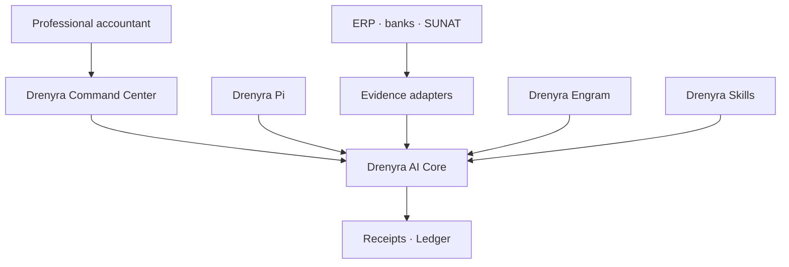

# Design 01 — Ecosystem Frontier and Authority

> [!IMPORTANT]
> **Status: APPROVED.** This design freezes the ecosystem frontier and the authority model — which component owns what, what each must never do, and how authority flows from a professional request to a signed receipt. It is the normative specification; existing architecture docs describe the current implementation and defer to this design for boundary decisions.

<!-- -->

> **Part of:** [Architecture](../architecture.md) · **Design series:** Design 01 · **Last updated:** 2026-08-10

<!-- -->

> Fiscal convention: monetary values in the Drenyra ecosystem are BigInt cents; no float is ever used for money; version/sequence numbers are JSON integers, never floats.

## The approved frontier

Every producer feeds the Core; only the Core issues receipts and writes the ledger. Drenyra is the professional's window onto that state — never a second authority.

## Responsibilities

| Component | Responsibility | Never must |
| --- | --- | --- |
| **Drenyra** | Interface, trays, visualization, review, and approval | Reimplement gates or modify states directly |
| **Drenyra AI** | Missions, candidates, materiality, authority, gates, receipts, ledger, and recovery | Depend on the UI or trust agent narration |
| **Drenyra Pi** | Optimized harness to run specialized agents | Resolve versions from `PATH` or bypass the Core |
| **Drenyra Engram** | Institutional memory and context retrieval | Authorize actions or treat memories as evidence |
| **Drenyra Skills** | Versioned accounting, fiscal, and jurisdictional knowledge | Silently change frozen policies |
| **Adapters** | Obtain evidence from ERP, banks, SUNAT, and files | Declare success without a verifiable response |
| **Guardian Angel** | Independent, adversarial review | Approve its own work or replace the professional |

## The chain of authority

1. The professional requests a result from Drenyra.
2. Drenyra creates a mission through Drenyra AI's published contract.
3. Agents research, propose, and prepare candidates.
4. Drenyra AI computes identity, scope, and materiality.
5. Gates determine what evidence and approval are required.
6. The professional approves when appropriate.
7. An adapter executes or confirms the external action.
8. Drenyra AI records the result with a signed receipt and a verifiable ledger — and Drenyra only presents the authoritative state returned by the Core.

## The dependency rule

- **Drenyra and Drenyra Pi consume published versions of Drenyra AI. Drenyra AI never depends on them.**
- The UI can go down and be rebuilt from Core state; a transcript can be lost and the mission recovered from events and evidence.
- **No consumer can turn a Core rejection into an approval.**

## Related documents

- [Authority Model](../architecture/authority-model.md) — the conceptual chain (memory guides → policy restricts → evidence demonstrates → receipt certifies → professional authorizes)
- [Ecosystem Boundaries](../architecture/ecosystem-boundaries.md) — what Drenyra AI is and is not
- [Ecosystem Integration](../architecture/ecosystem-integration.md) — who consumes what
- [Dependency Direction](../architecture/dependency-direction.md) — the MAY/NEVER dependency graph
- [Trust Boundaries](../architecture/trust-boundaries.md) — where each trust decision fails closed

---

**Read next:** [Architecture](../architecture.md) — back to the index
