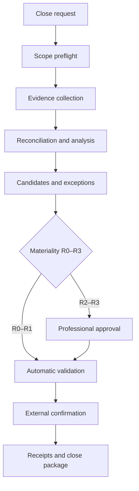

# Design 02 — Monthly Accounting and Tax Close

> [!IMPORTANT]
> **Status: APPROVED — the v1.0 flagship flow.** The professional never runs an agent chain manually. Their primary interaction is: *"Prepare the July 2026 close for Company X."* Drenyra asks only for the RUC, period, and scope it cannot safely derive on its own.

<!-- -->

> **Part of:** [Architecture](../architecture.md) · **Design series:** Design 02 · **Last updated:** 2026-08-10

<!-- -->

> Fiscal convention: monetary values in the Drenyra ecosystem are BigInt cents; no float is ever used for money; version/sequence numbers are JSON integers, never floats.

## The flow

## 1. Preflight — the scope freezes before any work

Drenyra AI freezes the scope up front:

- RUC and company.
- Fiscal period.
- Books and modules included.
- Expected sources.
- Currency and jurisdiction.
- Identity of the responsible professional.
- Peruvian policies and skills at exact versions.

A later scope modification creates an **explicit event** — it never silently mutates the existing mission.

## 2. Evidence collection

Adapters gather and hash:

- Electronic vouchers (comprobantes electrónicos).
- Purchase and sales registers.
- SIRE proposals.
- Bank statements.
- General ledger and trial balance.
- Detractions, withholdings, and perceptions.
- Evidence from ERP or SUNAT.

If an indispensable source is missing, the mission enters **WAITING_FOR_EVIDENCE**. The agent neither invents values nor interprets absence as zero.

## 3. Reconciliation and analysis

Specialized agents work over **immutable copies**:

- Bank reconciliation.
- ERP–SUNAT–SIRE comparison.
- Duplicate and wrong-period detection.
- IGV and document validation.
- Atypical account or balance identification.
- Review of detractions, perceptions, and withholdings.

Agents produce observations and candidates; they do not yet modify the authoritative book.

## 4. Accounting candidates

Each proposed correction carries:

- Content-derived identity.
- RUC, company, and period.
- Accounting explanation.
- Accounts, amounts, and currency.
- Source evidence.
- Tax impact.
- Reversibility.
- Materiality R0–R3.
- Skill and policy used.
- Analysis confidence — **separate from authority**.

Changing any datum yields a different identity and forces revalidation.

## 5. Proportional review

- **R0** — read, classify, or analyze without mutation.
- **R1** — reversible, low-materiality action.
- **R2** — material accounting impact; requires professional approval.
- **R3** — fiscal consequence, irreversible, or high materiality; requires **two distinct approvers** when the policy determines it.

The system allows **one bounded correction** of a candidate. If it is still incorrect, it escalates — no unlimited self-repair loops.

## 6. Execution confirmation

An agent can never assert on its own:

> "The journal entry was posted." · "SUNAT accepted the declaration." · "The voucher was accepted." · "The reconciliation was booked."

Those assertions require evidence from the external system: **identifier, state, provenance, moment, and hash of the response**. Without it, Drenyra clearly distinguishes between **prepared**, **approved**, and **externally confirmed**.

## 7. The close result

The professional receives a **verifiable package**:

- Executive summary.
- Sources used and missing.
- Reconciliations.
- Unresolved exceptions.
- Approved and rejected candidates.
- External execution evidence.
- Signed receipts.
- Full ledger.
- Pending risks.
- Final period state.

> [!NOTE]
> **COMPLETED means the declared mission scope finished — it does not automatically imply SUNAT accepted anything without evidence.**

## Safe recovery

| Situation | Response |
| --- | --- |
| A file is missing | `WAITING_FOR_EVIDENCE` |
| A gate rejects the transition | `BLOCKED_BY_GATE` |
| An adapter fails temporarily | `RETRYING` |
| The process is interrupted | `RECOVERING → UNKNOWN` |
| Execution evidence exists | Reconcile without repeating |
| It cannot be determined what happened | Request human intervention |
| The professional rejects | `REJECTED → REVISION_REQUESTED` |

Recovery always consults persisted state, idempotency keys, and evidence — it never re-executes an operation because the agent "remembers" having failed.

## Relation to Design 01

This flow is the flagship instance of the [Design 01 chain of authority](design-01-ecosystem-frontier-and-authority.md): the professional requests from Drenyra, the Core stages and gates, adapters provide external evidence, and the close package is the signed, ledger-backed result.

---

**Read next:** [Design 03 — Agents, Skills, and Integrations](design-03-agents-skills-integrations.md) · [Architecture](../architecture.md) — back to the index · [Design 01](design-01-ecosystem-frontier-and-authority.md) — the frontier and authority model
