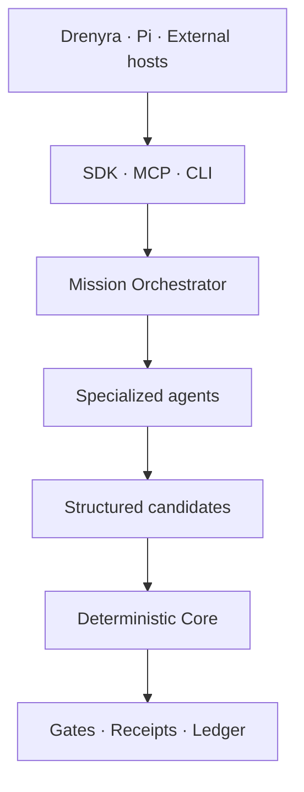

# Design 03 — Agents, Skills, and Integrations

> [!IMPORTANT]
> **Status: APPROVED.** The architectural rule: **use AI to interpret, investigate, and propose; use deterministic code to compute, validate, authorize, and record.** Not every function becomes an "agent" — monetary calculations, states, materiality, isolation, gates, hashes, and receipts stay outside the model.

<!-- -->

> **Part of:** [Architecture](../architecture.md) · **Design series:** Design 03 · **Last updated:** 2026-08-10

<!-- -->

> Fiscal convention: monetary values in the Drenyra ecosystem are BigInt cents; no float is ever used for money; version/sequence numbers are JSON integers, never floats.

## The flow



## Orchestration

**MissionOrchestrator** controls the mission but holds **no fiscal authority**. Its responsibilities:

- Split the close into bounded jobs.
- Select compatible agents and skills.
- Provide minimal context and immutable evidence.
- Control budget, attempts, and concurrency.
- Receive structured results.
- Deliver candidates to the Core.
- Pause when evidence or a human decision is missing.

**The Core remains the only component able to accept a transition.**

## Initial agents

| Agent | Responsibility | Allowed result |
| --- | --- | --- |
| **Close Coordinator** | Coordinate the close and its dependencies | Execution plan and state |
| **Evidence Agent** | Inventory, classify, and check sources | Evidence manifest |
| **Invoice/SIRE Agent** | Compare vouchers, ERP, and SIRE | Exceptions and candidates |
| **Reconciliation Agent** | Reconcile banks, books, and auxiliaries | Explained differences |
| **Journal Candidate Agent** | Propose accounting corrections | Candidate journal entries |
| **Compliance Agent** | Apply Peruvian tax policies | Findings and requirements |
| **Guardian Angel** | Independent adversarial review | Findings — never approval |

Each agent receives a **bounded task** and returns a **known schema**. Free text may accompany the explanation but never replaces structured amounts, references, hashes, or states.

## Drenyra Skills

Three layers:

| Layer | Examples | Stability |
| --- | --- | --- |
| **Foundation** | Evidence, isolation, money, candidates, recovery | Very stable |
| **Peru** | SUNAT, SIRE, IGV, detractions, withholdings, perceptions | Versioned by validity period |
| **Practice / sector** | Commerce, services, agriculture, mining, accounting firms | Extensible later |

Each skill requires:

- Identifier and version.
- Jurisdiction and validity period.
- Normative sources.
- Declared inputs and outputs.
- Required permissions.
- Maximum autonomy level.
- Tests and fixtures.
- Contract compatibility.
- Signature or checksum.
- Replacement and retirement policy.

> [!NOTE]
> A normative update never retroactively modifies a mission. The receipt records exactly which skill and policy version was used.

## v1.0 Integrations — recommended order

1. **Drenyra SDK/API** — the Command Center's primary surface.
2. **Drenyra Pi** — its own harness with an exact Drenyra AI version.
3. **MCP server** — uniform access for external hosts.
4. **Codex, Claude Code, OpenCode** — first agent adapters.
5. **ERP / SUNAT / banks** — evidence and confirmed-execution connectors.

Drenyra AI **detects and configures existing hosts** — following Gentle-AI's philosophy, it never installs Codex, Claude, or OpenCode for the user.

```bash
drenyra-ai install       # configure selected integrations
drenyra-ai doctor        # strictly read-only diagnostics
drenyra-ai sync          # update managed assets without overwriting foreign changes
drenyra-ai capabilities  # declare available contracts, skills, jurisdictions, adapters
```

## Models and providers

Drenyra AI is **provider-agnostic**:

- Models are selected by capability, cost, and risk.
- A mission may use different models per specialty.
- Prompts and models are recorded as provenance.
- Changing models never alters contracts or authority.
- No confidence score reduces a required approval.
- Results are validated against schemas before entering the Core.

This allows a powerful model as coordinator and efficient models for extraction or classification — without coupling the system to OpenAI, Anthropic, or DeepSeek.

## Relation to the design series

- [Design 01](design-01-ecosystem-frontier-and-authority.md) defines the frontier: agents propose, the Core decides, adapters bring external evidence.
- [Design 02](design-02-monthly-close.md) defines the flagship close flow; this design defines the agents, skills, and integrations that execute it.

---

**Read next:** [Design 04 — Persistence, Security, and Recovery](design-04-persistence-security-recovery.md) · [Architecture](../architecture.md) — back to the index · [Design 02](design-02-monthly-close.md) — the flagship flow
