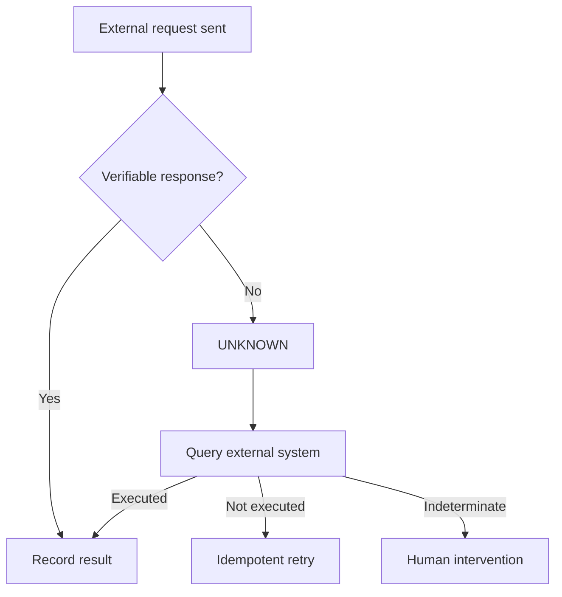

# Design 04 — Persistence, Security, and Recovery

> [!IMPORTANT]
> **Status: APPROVED.** The central rule: **authoritative state lives in persisted events, evidence, and receipts — never in the conversation or the model's memory.**

<!-- -->

> **Part of:** [Architecture](../architecture.md) · **Design series:** Design 04 · **Last updated:** 2026-08-10

<!-- -->

> Fiscal convention: monetary values in the Drenyra ecosystem are BigInt cents; no float is ever used for money; version/sequence numbers are JSON integers, never floats.

## Storage model

| Store | Content | Ownership |
| --- | --- | --- |
| **PostgreSQL** | Missions, events, candidates, approvals, gates, idempotency | Transactional state |
| **Object storage** | XML, PDF, statements, and original evidence | Immutable artifacts, hash-addressed |
| **Append-only ledger** | Ordered, chained receipts | Verifiable history |
| **KMS / Key Vault** | Ed25519 keys and connector secrets | Cryptographic material |
| **Policy Registry** | Versioned skills and policies | Reproducible rules |
| **Engram** | Decisions, context, institutional knowledge | Non-authoritative memory |

> [!NOTE]
> The current JSON adapter is limited to development and demonstrations. Production requires transactions, concurrency control, and durable persistence.

## Authoritative data model

Every fiscal entity carries, mandatorily:

- `tenantId`
- `ruc`
- `companyId`
- `fiscalPeriodId`
- `missionId`
- `schemaVersion`
- `createdAt`
- Identity of the actor or originating system

**Scope is part of queries, mutations, unique constraints, idempotency keys, and hashes** — filtering after reading is not enough.

## Evidence

Original files are stored once and referenced by:

- Cryptographic hash.
- Type and format.
- Provenance system.
- Date of acquisition.
- Declared period.
- Actor or connector that provided it.
- Verification state.
- Retention policy.

> [!WARNING]
> **Documents are untrusted input.** A PDF, XML, or description can never introduce instructions to the agent, modify permissions, or request additional tools.

## Approvals

An approval binds to:

- Exact candidate hash.
- Exact scope.
- Computed materiality.
- Available evidence.
- Approver identity and role.
- Approval moment.
- Applied policy.

If the candidate, relevant evidence, or scope changes, the approval **stops governing the new version**. For R3, the two approvers must be distinct identities meeting the required roles.

## Idempotency and concurrency

Every material operation uses an idempotency key derived from:

```text
tenant + company + fiscalPeriod + intent + candidateIdentity
```

The system also uses:

- Optimistic concurrency.
- Expected versions.
- Fencing tokens for workers.
- Database uniqueness.
- Inbox/outbox for messages.
- Retry deduplication.
- External confirmation before repeating mutations.

Two agents may analyze in parallel, but they cannot confirm the same candidate twice.

## Unknown states

When an external call is interrupted after being sent, the result is **not automatically marked as an error**:



This rule prevents duplicate postings, submissions, or declarations from a blind retry.

## Error classification

| Class | Examples | Response |
| --- | --- | --- |
| Invalid input | Wrong schema, currency, or period | Reject without executing |
| Scope | Incompatible RUC or company | Fail closed and alert |
| Evidence | Missing source or invalid hash | Wait for evidence |
| Policy | Skill not in force or incompatible | Block the mission |
| Approval | Insufficient approver or changed candidate | Request a new approval |
| Transient | Timeout before confirmed send | Bounded retry |
| Unknown result | Connection lost after send | Reconcile before repeating |
| Integrity | Invalid signature, ledger, or receipt | Stop the affected surface |
| Terminal | Non-recoverable action | Fail preserving evidence |

There are **no silent errors and no states converted into success for interface convenience**.

## Security controls

- Encryption in transit and at rest.
- Secrets outside prompts, logs, and public receipts.
- Tools granted by capability and mission.
- Egress limited to authorized destinations.
- Separation between read, propose, approve, and execute.
- Document sanitization against prompt injection.
- Signature verification and signer trust.
- Access audit on evidence.
- Configurable information minimization and retention.
- Connector and key revocation.
- **Guardian Angel in read-only mode over frozen candidates.**

> [!IMPORTANT]
> **The model may be compromised or wrong and still must not be able to skip a gate, cross a tenant, forge an approval, or rewrite the ledger.**

## Relation to the design series

- [Design 01](design-01-ecosystem-frontier-and-authority.md): adapters bring external evidence; this design pins how that evidence is stored, verified, and retrieved.
- [Design 02](design-02-monthly-close.md): the close flow's safe recovery is this design's state machine in action.
- [Design 03](design-03-agents-skills-integrations.md): orchestration and agents run over this storage and security foundation.

---

**Read next:** [Design 05 — Testing, Releases, and the v1.0 Definition](design-05-testing-releases-v1.md) · [Architecture](../architecture.md) — back to the index · [Design 03](design-03-agents-skills-integrations.md) — agents, skills, and integrations
