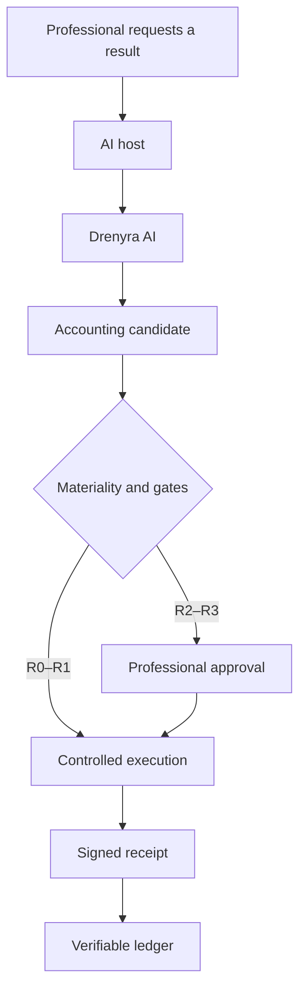

# Intended Usage — Drenyra AI

> [!IMPORTANT]
> **The frontier:** Drenyra AI is not "an agent that does accounting." It is the infrastructure that lets any agent participate in accounting processes without becoming the fiscal authority.

<!-- -->

> **The institutional thesis:** The AI proposes. The system validates. The professional decides. The evidence remains.

## Definition

**Drenyra AI is the configurator and runtime ecosystem that equips AI agents with memory, knowledge, workflows, controls, and evidence to perform verifiable accounting and fiscal work.**

It is a **configurator, runtime, and control plane** for accounting and fiscal agents:

- **Configurator** — `drenyra-ai install` / `doctor` / `sync` / `upgrade` equip the agent host(s) you already use (Codex, Claude Code, OpenCode, Pi) with accounting memory, skills, missions, materiality controls, approvals, and verifiable evidence.
- **Runtime** — missions with a frozen 15-state lifecycle, deterministic intent handlers that stage work, crash-safe recovery.
- **Control plane** — candidates, proportional review (R0–R3), gates, Ed25519 receipts, and an append-only audit ledger. The Core determines what may happen; agents never self-authorize.

## The philosophy, translated

Drenyra AI follows Gentle-AI's philosophy — it is not a sectorial copy of its code:

| Gentle-AI philosophy | Drenyra AI translation |
| --- | --- |
| Adapts existing agents | Adapts Pi and other hosts |
| The user asks for results, not phases | The professional asks for closes, reconciliations, or reviews |
| Small work stays direct | R0/R1 operations run with controlled autonomy |
| Complex work gets structured | Material fiscal operations become missions |
| SDD is optional and organic | Formal planning appears when complexity requires it |
| RDD converges on a frozen candidate | RDA converges on an identified accounting candidate |
| Engram keeps context | Drenyra Engram keeps institutional memory |
| Skills specialize the agent | Drenyra Skills provides accounting and jurisdictional knowledge |
| Receipts authorize delivery | Receipts prove what was proposed, approved, and executed |
| The system derives authority | Gates and approvals determine authority |
| doctor, sync, update, recovery | The ecosystem maintains itself automatically |
| After install it "disappears" | The accountant works normally; Drenyra controls underneath |

## The golden rule

> [!IMPORTANT]
> **The professional should never have to learn to operate an agent orchestration.** They ask for an accounting result and receive reviewable candidates, evidence, explicit decisions, and verifiable receipts.

## Stricter than Gentle-AI — the additional controls

Fiscal risk demands guarantees that software engineering does not:

1. **Memory never authorizes.** No observation is approval, permission, or authorization.
2. **Agents never approve themselves.** Approval is explicit, recorded, human.
3. **A signed XML is not an accepted CPE.** Acceptance by SUNAT is proven by external evidence, never by the document's own signature.
4. **No agent narration proves execution.** A story about SUNAT, a bank, or an ERP executing something proves nothing; only external evidence does.
5. **Autonomy derives from materiality, reversibility, and jurisdiction** — never from agent claims.
6. **Critical actions require external evidence and professional approval.**
7. **Mission recovery depends on persisted state, not transcript.** The event log is replayed from the last event; narration is never trusted.
8. **Without receipt, scope, or provable authority, the system fails closed.** Ambiguity is surfaced, never guessed through.

## The conceptual architecture



## What Drenyra AI is not

| Not this | Because |
| --- | --- |
| An agent that does accounting | The Core proposes nothing; it only stages and gates. Agents propose; humans and gates decide |
| The ERP | Posting, invoicing, and books of record live in Drenyra and external systems |
| The primary interface | Professionals work in the Accounting Command Center (Drenyra), not in Drenyra AI |
| The ledger of record | Drenyra AI provides the verifiable audit trail, not the books |
| A privileged gateway to SUNAT/banks/ERPs | External systems connect through adapters and evidence, never privileged access |
| The fiscal authority | Approval is explicit, recorded, human — never implied by the runtime |

## The responsibility split

| Component | Role |
| --- | --- |
| **Drenyra AI** | Protocols, missions, agents, candidates, gates, receipts, ledger |
| **Drenyra** | Accounting Command Center for professionals (consumes) |
| **Drenyra Pi** | Specialized harness to run the ecosystem (consumes, pinned package-local) |
| **Drenyra Engram** | Institutional memory — informs, never authorizes |
| **Drenyra Skills** | Versioned accounting, tax, and operational knowledge |
| **Drenyra Guardian Angel** | Independent, adversarial, continuous verification |
| **ERP / SUNAT / banks** | External systems connected via adapters and evidence |

## The target experience

After installation, a professional accountant should be able to say:

> "I use Codex, Claude, or OpenCode — but Drenyra gives them accounting memory, skills, missions, materiality controls, approvals, and verifiable evidence."

```bash
drenyra-ai install            # configure the accounting/fiscal agent runtime
drenyra-ai doctor             # read-only health check of the ecosystem
drenyra-ai mission start monthly-close
drenyra-ai candidate inspect correction.json
drenyra-ai gate check posting.json
drenyra-ai receipt verify receipt.json
drenyra-ai ledger validate ledger.json
```

## Equivalence with Gentle-AI

| Gentle-AI | Equivalent in Drenyra AI |
| --- | --- |
| Configures agent runtimes | Configures accounting/fiscal agent runtimes (`drenyra-ai install`) |
| Installer and TUI | Installer/configurator (`drenyra-ai install`) |
| SDD | Accounting missions and fiscal specifications |
| RDD (Receipt-Driven Development) | RDA (Receipt-Driven Accounting) |
| Code candidate | Posting, reconciliation, or declaration candidate |
| Review receipt | Accounting/fiscal receipt (Ed25519, canonical vectors) |
| Pre-commit/push/PR gates | Gates before posting, approving, declaring, or filing |
| Engram memory | Drenyra Engram — informs, never authorizes |
| gentle-pi harness | Drenyra Pi — pinned package-local runtime |
| Skills registry | Drenyra Skills — versioned accounting/tax knowledge |
| doctor / sync / upgrade / rollback | `drenyra-ai doctor` / `sync` / `upgrade` / rollback |

The parallel is structural, not literal: every Gentle-AI control maps to an accounting control with **stricter guarantees** — receipts are signed, the ledger is append-only and canonical-vector-verified, review scales with materiality, and approval is always explicit and recorded.

## Frontier rules

1. **Agents propose; the Core decides.** No agent claims SUNAT, bank, or ERP execution. No agent performs fiscal approval.
2. **Nothing material happens without a receipt.** RDA is the unit of proof; verification is offline and from canonical vectors.
3. **Gates, not faith.** Every lifecycle transition validates authority, scope, and receipts before posting, approving, declaring, or filing.
4. **Memory informs; it never authorizes.** No observation is approval, permission, or authorization.
5. **Risk-proportional review.** R0 high autonomy → R3 explicit dual approval, derived from materiality — never chosen ad hoc.
6. **Fiscal discipline.** Money is whole-number cents (BigInt); tenant/RUC/period scope is mandatory; every mutation produces an immutable receipt.

## Quick path

1. Read the [Trust Model](architecture/trust-model.md) — what the runtime can prove and where authority lives.
2. Read the [Contracts](../contracts/README.md) — the frozen public surface (start at the root `contracts/` index).
3. Integrate via released, versioned artifacts — never a checkout. Consumers (Drenyra, Drenyra Pi) upgrade on their own cadence.

## Next steps

- The architecture and layer model → [Architecture](architecture.md)
- The frozen contracts → [Contracts](../contracts/README.md)
- What is planned → [ROADMAP.md](../ROADMAP.md)
- The project overview → [README.md](../README.md)
