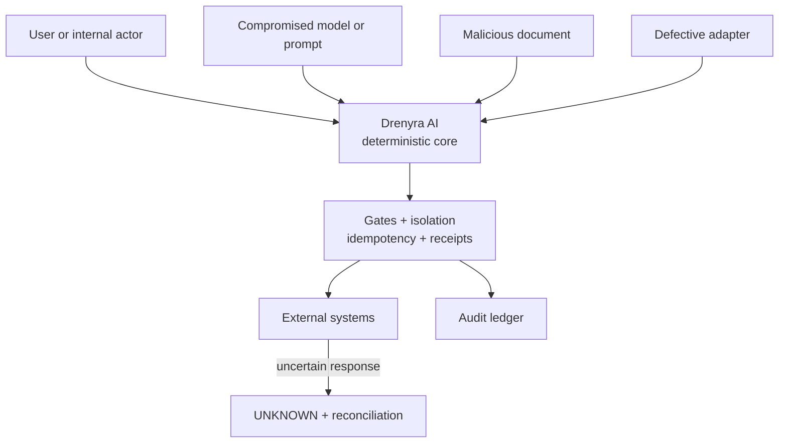

# Acceptance Matrix — Drenyra Dominion Program

> Status: DRAFT (v0.1) · Source: Design 6 of the program brief
> Drenyra reaches v1 not by feature count or a demo, but when it can operate
> real accounting processes without a compromised model, a crash, or a
> defective integration breaking its authority limits.

## 1. Threat model

The system assumes any of these may fail or be hostile:

The Core must remain safe even when:

- The model fabricates results.
- A PDF contains prompt injection.
- A user attempts to cross tenants.
- An approver reuses an authorization.
- Two workers execute simultaneously.
- The response is lost after sending an operation.
- An adapter declares capabilities it does not have.
- A ledger entry is reordered or deleted.
- A key is compromised or revoked.
- Command Center sends stale state.

## 2. Mandatory controls

- Deny by default.
- Separation between read, propose, approve, execute, confirm.
- Full scope in queries, hashes, idempotency keys, and database constraints.
- Credentials outside prompts, public receipts, and logs.
- KMS or vault for production keys.
- Egress allowed only to declared destinations.
- Sanitization of untrusted documents.
- Signatures and trust store with rotation and revocation.
- Optimistic concurrency, fencing, inbox/outbox.
- Configurable retention and minimization.
- Audit of evidence access.
- Explicit, temporary, justified, receipted break-glass; never removes
  integrity gates.
- Guardian Angel read-only over frozen candidates.

## 3. Verification matrix

| Level | What it demonstrates |
| --- | --- |
| Conformance | Frozen contracts do not drift between repos |
| Unit | States, materiality, policies, hashes, gates |
| Property-based | Money, canonicalization, idempotency, ledger |
| Integration | PostgreSQL, object storage, KMS, real transactions |
| Contract tests | Each adapter meets its capability manifest |
| Recovery | Every transition can be interrupted and recovered |
| Cross-tenant | No read or mutation crosses scopes |
| Adversarial | Injection, replay, altered receipts, fake approvals |
| Journey | An operator completes a process from a real surface |
| Federated E2E | All repos work with the exact program-lock |
| Professional acceptance | The accountant understands blocks, evidence, decisions |

## 4. Non-negotiable scenarios

Every release candidate must test:

1. Evidence altered after approval.
2. Two concurrent executions of the same candidate.
3. Crash before and after an external call.
4. Lost external response.
5. Signed XML without acceptance record.
6. Fiscal skill out of vigencia.
7. Document with malicious instructions.
8. Use of another tenant's evidence.
9. Same approver used twice in R3.
10. Key rotation or revocation.
11. Ledger with deleted or reordered entries.
12. Schema migration with active missions.
13. Valid JSON but accounting-incoherent.
14. UI operating on a stale mission version.
15. Adapter losing idempotency or reconciliation capability.
16. Pi or Command Center restart during an approval.
17. Skill updated while an earlier mission is still active.
18. Attempt to treat Engram memory as evidence.
19. Corrected candidate widening the original scope.
20. Valid receipt used on a different company or period.

## 5. Telemetry without authority

Observability shows: mission duration/state · time waiting for evidence or
approval · candidate rejection rate · UNKNOWN results and reconciliation time ·
avoided retries · Guardian findings · connector failures · cost per
mission/agent/model · skill and contract drift · scope-denied accesses.

Telemetry may alert and recommend; it may NOT modify materiality, approve
candidates, or close missions.

## 6. Commercial gate: private → open core

The private stage continues while Drenyra validates product and generates
revenue. Opening requires a formal decision based on conditions, not a
promotional date.

**Proposed gate:**

- At least three pilot firms.
- At least one internal accounting team.
- Two consecutive production closes per pilot without critical incident.
- Revenue or funding sufficient to sustain maintenance.
- Public contracts stabilized and audited.
- Demonstrated technical separation between portable core and commercial services.
- Legal review of license, IP, and contributions.
- Commercial model for cloud, certified connectors, and support defined.

**Future opening does NOT automatically include:** managed infrastructure ·
credentials or private connectors · premium policy packs · enterprise console ·
multi-region operation · support/SLA/certifications · client data,
configurations, or telemetry.

## 7. Definition of v1

See [charter.md §8](charter.md#8-success-definition-v1). Summary: complete
Peruvian monthly close from Command Center; firm + internal team on the same
Core; documented SDK/CLI/MCP; configurable Codex/Claude/OpenCode/Pi; versioned
Peruvian skills; offline-verifiable receipts; production PostgreSQL/object
storage/KMS; recovery without duplication; three independent contract
consumers; professional pilots who accept the blocks; reproducible
`program-lock`; runbooks; zero duplicated normative functions.

## 8. Real domain metrics

| Metric | Target |
| --- | --- |
| % of close covered end-to-end | Increasing |
| Manual hours saved per company | Increasing |
| Exceptions detected before filing | Increasing |
| Material actions with full evidence | 100% |
| Blind retries | 0 |
| Cross-tenant violations | 0 |
| Incompatible approvals accepted | 0 |
| Mean time to resolve an exception | Decreasing |
| Mean time to reconcile UNKNOWN | Decreasing |
| % of decisions the professional understands without technical help | High |
| Operating cost per company per period | Decreasing |
| Repeated adoption after first close | Increasing |
