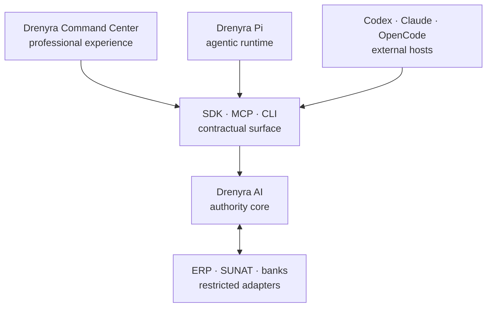
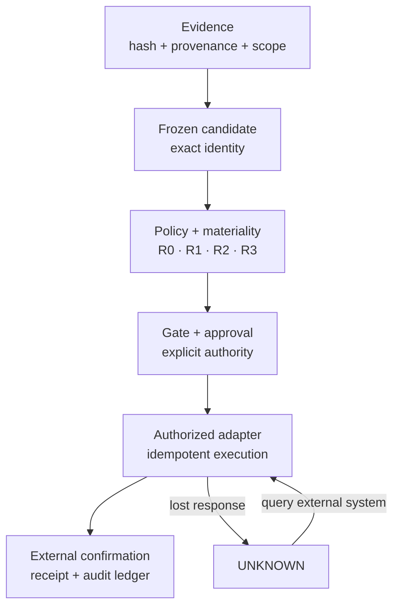
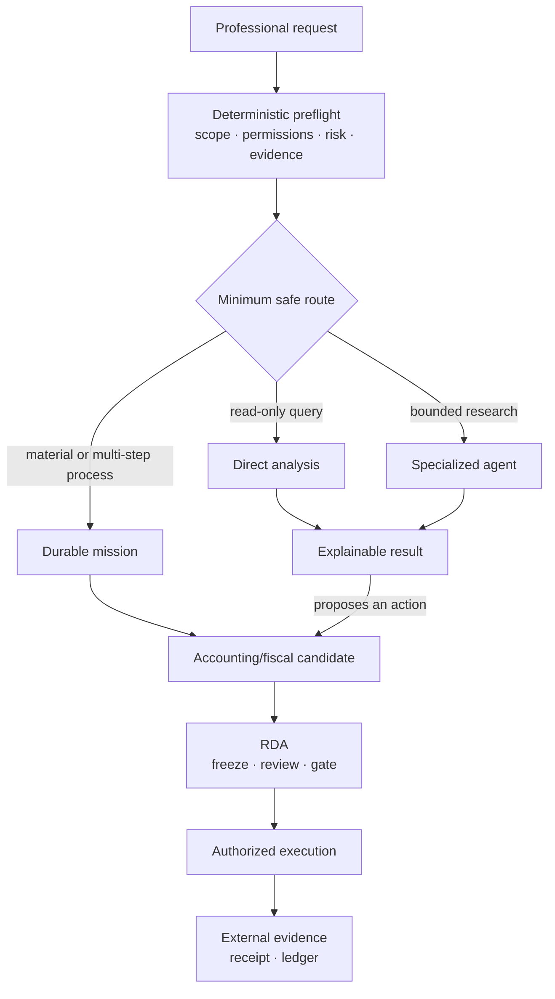
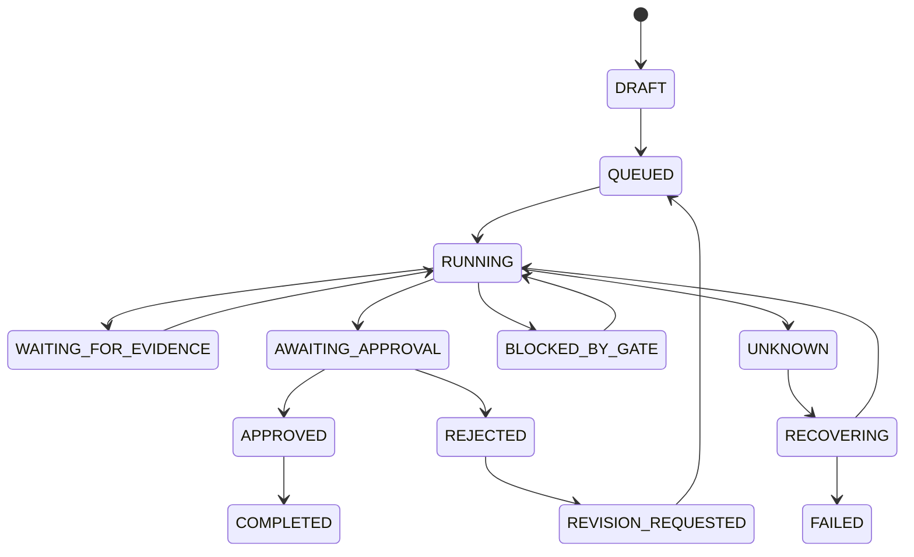
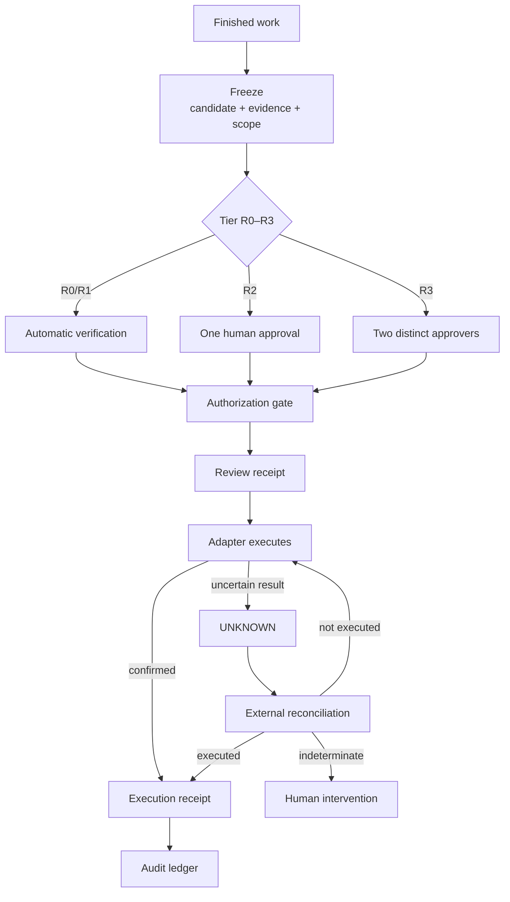

# Authority Model — Drenyra Dominion Program

> Status: DRAFT (v0.1) · Source: Designs 1, 2, and 4 of the program brief
> This document is the authority backbone of the ecosystem. It defines who may
> observe, who may decide, who may execute, and the transactional mechanics
> (RDA v2) that make accounting work provable.

## 1. Central rule

> **Everyone may observe, interpret, and propose. Only Drenyra AI determines
> which transition is allowed. Only an authorized adapter executes. No
> component may approve itself.**



The state machine, the gates, the materiality derivation, and the approval
binding live ONLY in the Core. Every other surface is a projection.

## 2. Mandatory authority chain



`UNKNOWN` never re-executes automatically: it first queries the external
system and reconciles what occurred.

## 3. Constitutional rules

1. **Central authority, distributed execution.** Repositories collaborate, but
   `drenyra-ai` keeps the deterministic decision.
2. **State owned by the provider.** Command Center, Pi, and hosts consult
   `status` and `nextTransition`; they never reconstruct the state machine.
   Direct lesson from Gentle-AI v2.4.x.
3. **Review after freezing the candidate.** Reviewers inspect exactly the
   bytes that could execute. If the candidate changes, previous approvals and
   receipts stop governing it.
4. **Configurable autonomy within limits.** Tighten or automate up to the
   ceiling; never lower the regulatory minimum.
5. **Memory is not evidence.** Engram remembers; only the verifiable external
   response proves.
6. **Skills immutable during a mission.** Missions pin versions, normative
   sources, vigencia, checksum, jurisdiction. Fiscal updates affect new
   missions only.
7. **Frozen contracts protected.** The six v0.1 contracts stay intact; new
   relationships compose; breaks require major version + migration.
8. **One receipt, multiple consumers.** All consumers verify the same signed
   artifact.
9. **Every denial includes an exit.** Typed cause + missing evidence +
   executable next action.
10. **Prepared for future open core.** Contracts and verifiers are cloud/UI/
    connector-independent.

## 4. Organic work routing

Drenyra routes every request through a deterministic preflight, then picks the
smallest safe route:



| Route | When used | Persistence | Authority |
| --- | --- | --- | --- |
| Direct analysis | Read-only query, small scope | Result + sources when relevant | No mutation |
| Specialized agent | Reconciliation, classification, bounded research | Work unit, evidence, structured result | Proposes only |
| Durable mission | Close, declaration, material correction, multi-dependency | Events, attempts, candidates, decisions, receipts | Passes through the Core |

**Selection criteria** (never file/agent count alone): materiality ·
reversibility · external evidence need · duration/interruptibility · systems
involved · segregation of duties · regulatory obligations · approval need.

### 4.1 Mission lifecycle

The 15 frozen states remain normative. Surfaces show a contextual projection
but never create alternative states:



### 4.2 Work units and bounded attempts

Every agent receives a `WorkUnit` with:

- `missionId` and exact objective.
- Full scope: tenant, RUC, company, period.
- Evidence allowed by hash.
- Skill and policy pinned by version.
- Authorized tools and destinations.
- Mandatory output schema.
- Time/token/cost/attempt budgets.
- Verifiable success condition.
- Typed reasons to stop.

**Two distinct budgets:**

| Budget | Limit |
| --- | --- |
| Research/technical execution attempts | Configurable max, initially up to 3 |
| Frozen-candidate correction | Max ONE correction before escalating to the professional |

This prevents both infinite agent loops and a "second review" silently
rewriting the candidate.

### 4.3 Structured result, separate explanation

An agent may write a useful explanation, but authority consumes structured
fields:

```text
WorkResult
├── outcome
├── evidenceRefs[]
├── proposedCandidates[]
├── unresolvedExceptions[]
├── policyVersions[]
├── toolProvenance[]
├── costAndAttempts
└── nextTransition
```

Amounts use **BigInt in minimum monetary units**. No free text may introduce
authoritative amounts, states, permissions, or approvals.

### 4.4 Negotiated transitions

Following Gentle-AI v2.4.x's most important improvement:

- The Core publishes `status`, `eligibleTransitions`, `nextAction`.
- Command Center, Pi, CLI, MCP only render that decision.
- Every denial includes code, cause, compared data, executable continuation.
- The same deterministic function feeds both `status` and `apply` — they
  cannot contradict each other.
- A transition carries a review token or expected version to avoid deciding on
  stale state.

Example denial:

```json
{
  "allowed": false,
  "code": "EVIDENCE_REQUIRED",
  "cause": {
    "missing": ["bank-statement:BCP:202607"],
    "missionVersion": 18
  },
  "nextAction": {
    "type": "request_evidence",
    "command": "drenyra-ai evidence request --mission cls_01 --kind bank-statement"
  }
}
```

### 4.5 Autonomy and kill switches

| Autonomy level | Behavior |
| --- | --- |
| `off` | Proposal and review system only |
| `bounded` | Allows R0/R1 within policies |
| `governed` | Maximum permitted by organization and jurisdiction |

Non-negotiable, regardless of autonomy:

- Integrity gates can never be disabled.
- R2/R3 can never be degraded to auto-approval.
- Tenant isolation, receipts, and UNKNOWN reconciliation have no kill switch.
- Disabling autonomy never fabricates an approval; it returns the operation
  to the professional.

## 5. Receipt-Driven Accounting v2 (RDA v2)

RDA is the accounting equivalent of RDD in Gentle-AI, with an additional
separation between: proposal · review · authorization · external execution ·
verifiable confirmation.

> A review receipt proves the candidate was approved. It does NOT prove that
> SUNAT, the bank, or the ERP executed the operation.



### 5.1 Candidate identity

The frozen candidate is identified by a canonical hash over:

```text
CandidateIdentity
├── schemaVersion
├── tenantId
├── ruc
├── companyId
├── fiscalPeriodId
├── intent
├── subjectHash
├── evidenceSetHash
├── policySetHash
├── skillSetHash
├── materiality
├── currency
└── canonicalPayload
```

Changing any element creates a different candidate. Therefore:

- A previous approval stops governing it.
- Guardian Angel must review it again.
- The previous receipt stays historically valid but is incompatible with the
  new candidate.
- A correction consumes the original candidate's budget and creates a linked
  new review.

### 5.2 Receipt types

| Receipt | Proves | Does NOT prove |
| --- | --- | --- |
| Analysis | Which sources and policies were used | That an action was approved |
| Review | Review result over an exact candidate | External execution |
| Approval | Approver identity, role, decision | SUNAT/bank acceptance |
| Authorization | Gates allowed execution | That the adapter finished |
| Execution | Result confirmed by external system | Fiscal accuracy by itself |
| Reconciliation | How an UNKNOWN result was resolved | Retroactive authorization |
| Close package | Final composition of the close | Absolute absence of risk |

All share a signed, versioned envelope but carry different claims. The UI
never shows simply "verified" when only a review exists.

### 5.3 Autonomy policy A + C

The organization configures an autonomy profile, but the effective permission
is the intersection of limits:

```
A_effective = A_org ∩ A_jurisdiction ∩ A_skill ∩ A_connector ∩ A_materiality ∩ A_actor
```

| Level | Minimum behavior |
| --- | --- |
| R0 | Automate analysis and verifiable reversible tasks |
| R1 | Execute automatically if org permits and rollback exists |
| R2 | Requires at least one valid human approval |
| R3 | Requires two distinct approvers and segregation of duties |

An organization may raise R1 to R2/R3. It may NEVER lower R3 to R1.

### 5.4 Capacity ceilings

Policy is not amount-based only; it also considers irreversibility, destination,
and legal consequences.

| Capability | Initial ceiling |
| --- | --- |
| Classify documents | R1 |
| Detect duplicates and anomalies | R1 |
| Prepare reconciliations | R1 |
| Propose accounting entry | R2 |
| Record material entry | R3 |
| Prepare declaration | R2 |
| File with SUNAT | R3 |
| Schedule or make payments | R3 |
| Change policies or permissions | R3 |
| Delete evidence or receipts | Forbidden |

Ceilings are versioned policies, never constants buried in code.

### 5.5 Bounded correction

Review operates over a single candidate:

1. Freeze identity.
2. Derive tier.
3. Run the required lenses.
4. If severe findings, allow ONE correction.
5. An independent validator checks the correction answers the findings without
   silently widening scope.
6. If it fails again, escalate to the professional.

A correction may NOT: change tenant/period/intent · replace evidence without
invalidating approvals · raise permissions · hide previous findings · create a
second correction under an artificial identity.

### 5.6 Review lenses

| Lens | Question |
| --- | --- |
| Scope | Does everything belong to the correct RUC, company, period? |
| Evidence | Does every material claim have verifiable provenance? |
| Accounting | Double entry, currency, accounts, periodification coherent? |
| Tax | Were rules in force for jurisdiction and date? |
| Materiality | Was the R0–R3 level derived correctly? |
| Execution | Can the operation run idempotently and reconciliably? |
| Fraud/adversarial | Alterations, duplicates, collusion, malicious instructions? |
| Explainability | Can a professional understand and decide with this evidence? |

### 5.7 Mandatory gates

Before execution, the Core verifies: exact candidate identity · scope and
isolation · skill/policy vigencia · evidence integrity and provenance ·
recalculated materiality · sufficient, unreused approvals · segregation of
duties · compatible receipt · idempotency key · adapter capability/state ·
absence of a pending or UNKNOWN equivalent execution.

Gates RECALCULATE their decision. They never trust an `approved: true` boolean
sent by the UI or an agent.

### 5.8 RDA v2 invariants

- A receipt never claims more than it observed.
- An approval is not execution.
- A modified candidate does not inherit authorization.
- R3 always requires distinct identities.
- Guardian Angel is never part of the approval quorum.
- The same actor does not propose, approve, and confirm a material action.
- Absence of evidence produces wait or block, never assumption.
- An uncertain external result is never classified as terminal success/failure.
- The ledger records history; it never becomes the accounting journal.
- Disabling autonomy does not disable integrity or traceability.

## 6. Work result and accounting rules

- Amounts: `BigInt` in minimum monetary units. No floats.
- Free text may never carry authoritative amounts, states, permissions, or
  approvals.
- Every denial returns: code, cause, compared data, executable continuation.
- Restarting Pi, Command Center, or a host loses or duplicates no work.
- Changing model or provider changes neither authority nor contracts.
