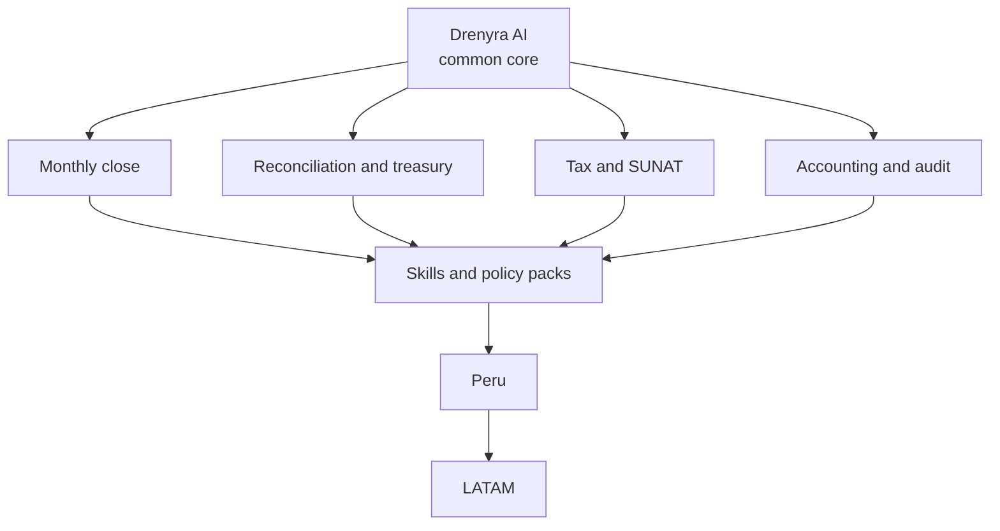
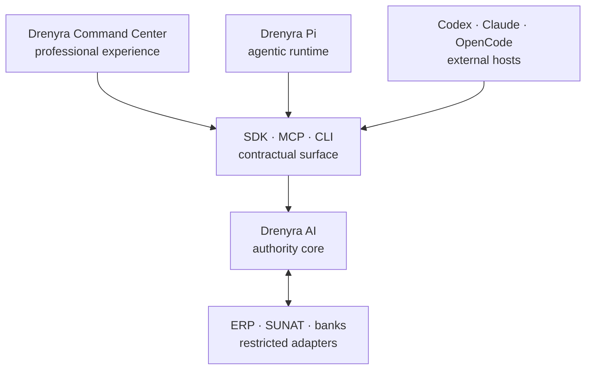
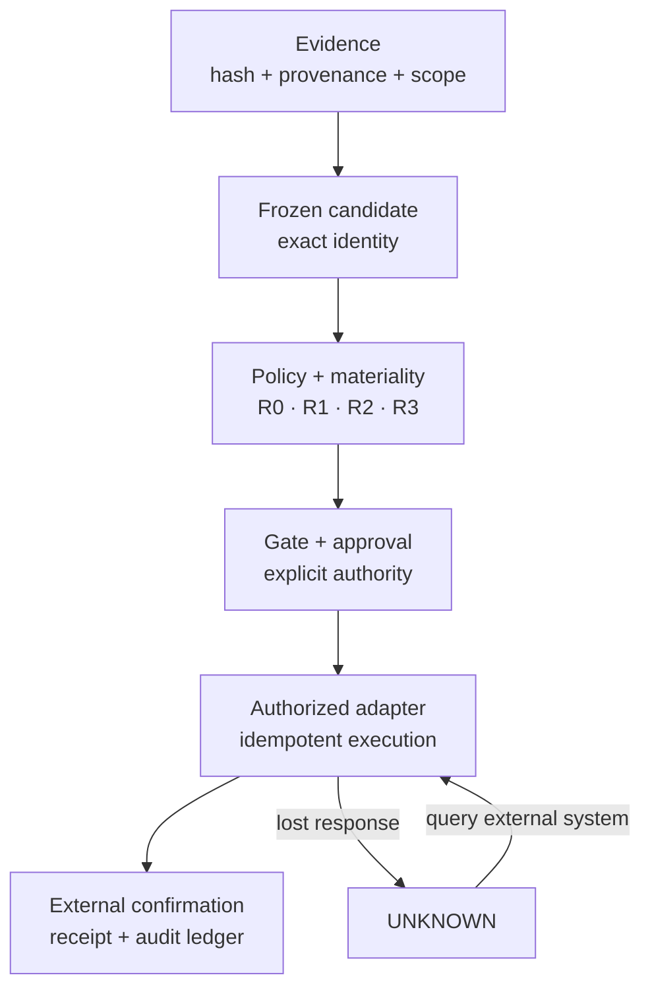
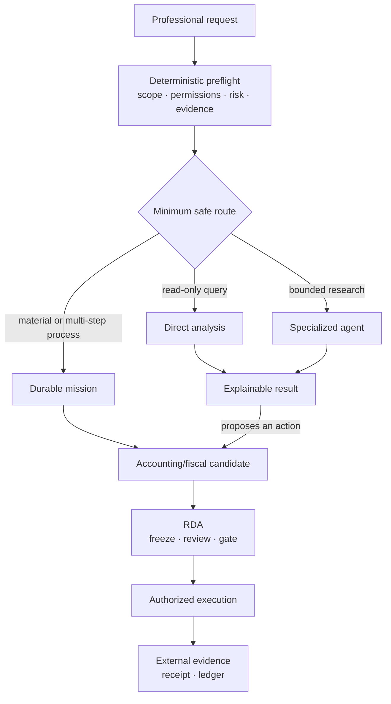

# Charter — Drenyra Dominion Program

> Status: DRAFT (v0.1) · Stage: private · Last updated: 2026-08-11
> This charter is the master SDD (SDD-000). It fixes vision, frontiers,
> authority, taxonomy, and domain criteria for the entire Drenyra ecosystem.

## 1. North Star

**"Dominate accounting"** means three measurable advantages, not a slogan:

1. **Coverage** — control the complete cycle, not an isolated task.
2. **Trust** — demonstrate every result through verifiable evidence.
3. **Distribution** — operate from Command Center and equip external agents
   via SDK, MCP, and CLI.

The first conquest is the **Peruvian monthly close**; the same core then
extends to the other accounting domains:

Drenyra reaches v1 not by feature count or an attractive demo, but when it can
operate real accounting processes without a compromised model, a crash, or a
defective integration breaking its authority limits.

## 2. Frontiers

### 2.1 What the ecosystem is

| Project | Role |
| --- | --- |
| Drenyra Command Center | Professional experience: requests, review, explanations, approvals, supervision |
| Drenyra Pi | Agentic runtime |
| Codex · Claude · OpenCode | External agent hosts |
| SDK · MCP · CLI | Contractual surface |
| Drenyra AI | Authority core |
| ERP · SUNAT · banks | Restricted adapters |

### 2.2 Repository ownership

| Component | Responsible for | Never may |
| --- | --- | --- |
| Drenyra Command Center | Requests, review, explanations, approvals, supervision | Invent states, receipts, or authority |
| Drenyra AI | Missions, candidates, materiality, policies, gates, approvals, recovery, audit ledger | Become an ERP, bank, or primary accounting ledger |
| Drenyra Pi | Execute agents and tools with pinned versions | Authorize fiscal operations |
| Drenyra Skills | Versioned, verifiable accounting/fiscal knowledge | Silently modify an active mission |
| Drenyra Engram | Institutional memory, prior decisions, context | Serve as evidence or approval |
| Guardian Angel | Independent adversarial review over frozen candidates | Approve, execute, or mutate candidates |
| Adapters | Read evidence and perform authorized external operations | Decide materiality or skip gates |

### 2.3 Mandatory authority chain

`UNKNOWN` does not automatically re-execute: it first queries the external
system and reconciles what happened.

## 3. Constitutional rules

1. **Central authority, distributed execution.** Repositories collaborate, but
   `drenyra-ai` keeps the deterministic decision.
2. **State owned by the provider.** Command Center, Pi, and hosts consult
   `status` and `nextTransition`; they never reconstruct the state machine
   themselves. Direct lesson from Gentle-AI v2.4.x.
3. **Review after freezing the candidate.** Guardian Angel and reviewers
   inspect exactly the bytes that could execute. If the candidate changes,
   previous approvals and receipts stop governing it.
4. **Configurable autonomy within limits.** An organization may tighten
   controls or automate up to the allowed ceiling; it may never lower the
   regulatory minimum.
5. **Memory is not evidence.** Engram may remember that a declaration was
   accepted, but only SUNAT's verifiable response can prove it.
6. **Skills immutable during a mission.** Each mission pins versions,
   normative sources, vigencia, checksum, and jurisdiction. A fiscal update
   affects new missions, never rewrites the past.
7. **Frozen contracts protected.** The six v0.1 contracts stay intact. New
   relationships are implemented by composition; any break requires a major
   version and migration.
8. **One receipt, multiple consumers.** Command Center, audit, CLI, ERP, and
   future integrators verify the same signed artifact, not different
   interpretations.
9. **Every denial includes an exit.** A block must return a typed cause,
   missing evidence, and an executable next action. Never a bare "operation
   rejected".
10. **Prepared for future open core.** Contracts and verifiers do not depend
    on cloud, UI, or commercial connectors, even though the product remains
    proprietary during the first stage.

## 4. Verifiable invariants

- 100% of material actions produce a receipt.
- 100% of approvals are bound to the exact candidate, scope, evidence, and policy.
- 0 paths allow an agent to authorize itself.
- 0 fiscal data crosses tenants without full context.
- 0 blind retries after an uncertain external response.
- 0 surfaces maintain alternative state machines.
- 0 Engram memories accepted as evidence.
- 0 retroactive skill changes on an started mission.

## 5. Taxonomy and domain criteria

Work is routed organically — Drenyra does not turn every question into a huge
mission. It adapts Gentle-AI v2.4.x organic routing to accounting risk:

> Use the smallest route that preserves evidence, authority, and recovery.

| Route | When used | Persistence | Authority |
| --- | --- | --- | --- |
| Direct analysis | Read-only query/explanation/inspection, small scope | Result and sources when relevant | No mutation |
| Specialized agent | Reconciliation, classification, bounded research needing its own context | Work unit, evidence, structured result | Proposes only |
| Durable mission | Close, declaration, material correction, multiple dependencies, recoverable work | Events, attempts, candidates, decisions, receipts | Passes through the Core |

File count, documents, or agent count alone never decides the route.
Selection considers: materiality · reversibility · need for external evidence ·
duration and interruptibility · number of systems involved · segregation of
duties · regulatory obligations · need for approval.

## 6. SDD contract

Every SDD in this program MUST contain, in order:

1. **Exploration** — repository evidence and real gaps.
2. **Proposal** — problem, outcome, scope, non-goals, trade-offs.
3. **Specification** — RFC 2119 requirements and Given/When/Then scenarios.
4. **Design** — components, contracts, threats, errors, decisions.
5. **Tasks** — vertical TDD units with exact files and commands.
6. **Apply progress** — changes made and authorized deviations.
7. **Verification report** — tests, results, evidence.
8. **Archive report** — versions, commits, compatibility, accepted debt.

An SDD may never mark a capability complete based only on documentation or
mocks.

### 6.1 Implementation policy

- Strict TDD mandatory.
- Initial maximum 400 authored lines per review unit.
- Larger changes delivered via chained PRs.
- Each PR produces a verifiable capability, never an incomplete layer.
- Feature branch + mandatory human review.
- Receipts over the exact candidate being delivered.
- The tracker integrates branches in dependency order.
- Rollback happens in reverse order without rewriting historical receipts.
- Frozen contracts do not change inside an ordinary implementation PR.

### 6.2 Program gates

An SDD cannot advance if it:

- Contradicts the authority model.
- Duplicates a normative function in another repo.
- Does not identify the producer–consumer contract.
- Depends on a moving branch.
- Breaks a frozen conformance suite.
- Introduces monetary floats.
- Uses memory as evidence.
- Adds external execution without UNKNOWN reconciliation.
- Lacks migration and rollback.
- Exceeds the review budget without splitting.
- Declares completed something proven only with mocks.

## 7. Gate 0

Before implementing SDD-020:

| # | Action | Status (gate-decision axis) |
| --- | --- | --- |
| 1 | Inventory active OpenSpec changes, including `fiscal-authority-kernel` | **satisfied** — inventory refreshed 2026-08-14, see [gate-0.md](gate-0.md) |
| 2 | Resolve overlaps and dependencies | **satisfied** — see [gate-0.md](gate-0.md) §2 |
| 3 | Align README, license, visibility, commercial messages with private stage | **pending** — cross-repo alignment unverified; visibility fact recorded in the evidence register |
| 4 | Provisionally freeze ICP, operators, first journey | **approved-pending-evidence** — decision not reopened, see [gate-0.md](gate-0.md) §3 |
| 5 | Register future open-core transition as intention, not contractual promise | **satisfied** — recorded in [charter.md §9](#9-open-core-transition) and READMEs |
| 6 | Create first capability matrix against real repo state | **satisfied** — see [capability-matrix.yaml](capability-matrix.yaml); W2 refresh scheduled |

**SDD-020 status:** **blocked**. Reconciled 2026-08-14 — rows 3 and 4 are not
`satisfied`, no waiver is recorded, so there is no implicit waiver; SDD-020
stays `lifecycle:planned` and must not start until [gate-0.md](gate-0.md) §4
records permission. Status vocabulary and evidence register:
[status-and-evidence.md](status-and-evidence.md).

## 8. Success definition (v1)

Drenyra v1 requires:

- Complete Peruvian monthly close from Command Center.
- Accounting firm and internal team using the same Core.
- Documented SDK, CLI, and MCP.
- Codex, Claude Code, OpenCode, and Drenyra Pi configurable.
- Versioned Peruvian skills with sources and vigencia.
- Offline-verifiable receipts for every material action.
- Production PostgreSQL, object storage, and KMS.
- Recovery without duplicating operations.
- Three independent consumers of the contracts.
- Professional pilots who understand and accept the blocks.
- Reproducible `program-lock` for the whole ecosystem.
- Incident, key, migration, and recovery runbooks.
- Zero duplicated normative functions between repositories.

## 9. Open-core transition

The private stage continues while Drenyra validates product and generates
revenue. Opening requires a formal decision based on conditions, not a
promotional date — see [acceptance-matrix.md](acceptance-matrix.md#6-commercial-gate-private-open-core).
This transition is registered as an **intention**, not a contractual promise.
