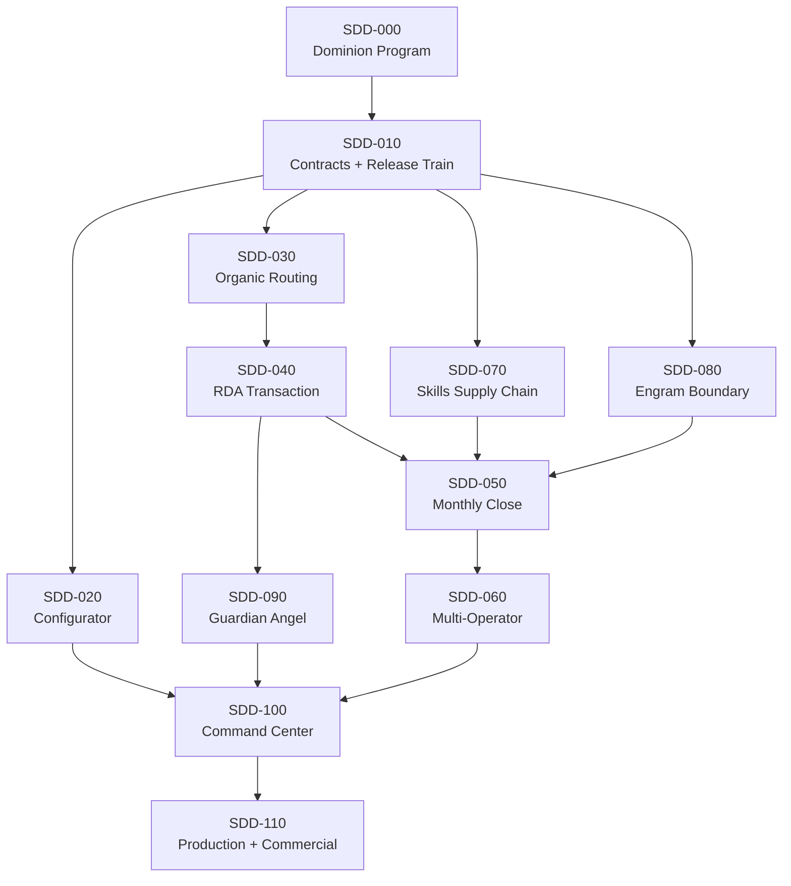
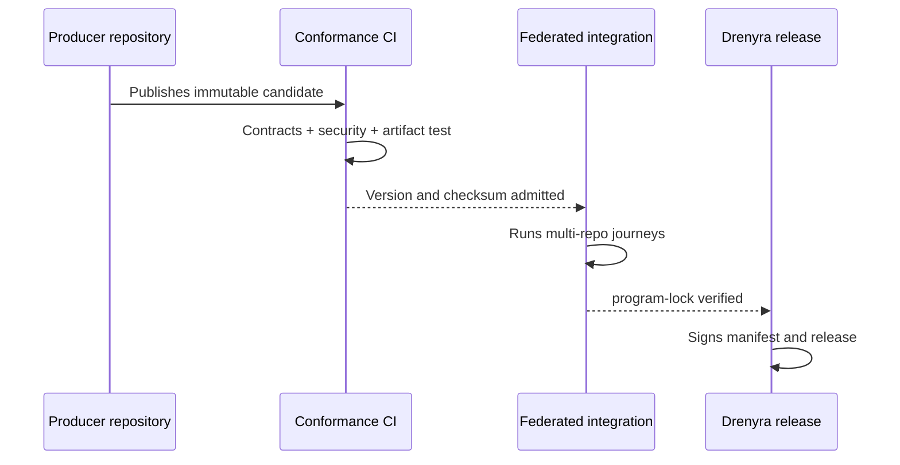

# Dependency Graph — Drenyra Dominion Program

> Status: DRAFT (v0.1) · Source: Design 3 of the program brief
> The program has one central source of truth in `drenyra-ai`; each
> repository keeps its own implementation, versioning, and tests.

## 1. SDD dependency graph



## 2. Federated source of truth

`drenyra-ai` maintains:

```text
openspec/programs/drenyra-dominion/
├── charter.md
├── authority-model.md
├── dependency-graph.md
├── capability-matrix.yaml
├── program-lock.json
├── release-train.md
├── acceptance-matrix.md
├── gate-0.md
└── sdds/
    ├── sdd-000-dominion/
    ├── sdd-010-contracts/
    ├── ...
    └── sdd-110-production/
```

Each participating repository holds ONLY its local change plus a reference to
this master program. Full specs are never copied into participant repos —
they would diverge.

## 3. `program-lock.json`

Every integrated checkpoint fixes exactly:

- Repository.
- Commit SHA.
- Package version.
- Contracts consumed and produced.
- Skills and policies included.
- Storage schemas.
- MCP/SDK compatibility.
- Conformance test status.
- Artifacts and checksums.

Therefore "Drenyra v0.x" represents a **reproducible composition** of the
ecosystem, not six `main` branches taken at different moments.

## 4. Per-SDD contract

Every SDD MUST contain: exploration · proposal · specification (RFC 2119 +
Given/When/Then) · design (components, contracts, threats, errors, decisions) ·
tasks (vertical TDD units with exact files/commands) · apply progress ·
verification report · archive report. A capability may never be marked complete
from documentation or mocks alone.

## 5. Implementation policy

- Strict TDD mandatory.
- Initial max 400 authored lines per review unit.
- Larger changes delivered via chained PRs.
- Each PR produces a verifiable capability, never an incomplete layer.
- Feature branch + mandatory human review.
- Receipts over the exact candidate delivered.
- The tracker integrates branches in dependency order.
- Rollback in reverse order without rewriting historical receipts.
- Frozen contracts do not change inside an ordinary implementation PR.

## 6. Waves

| Wave | SDDs | Verifiable outcome |
| --- | --- | --- |
| 0 — Constitution | 000–010 | Authority, contracts, multi-repo compatibility |
| 1 — Universal runtime | 020–040 | Configured hosts, organic routes, transactional RDA |
| 2 — Fiscal intelligence | 070–090 | Verifiable skills, bounded memory, independent Guardian |
| 3 — Flagship product | 050–060–100 | Monthly close for firms and internal teams via Web UI |
| 4 — Production | 110 | Real connectors, KMS, observability, pilots, commercial operation |

Wave 3 depends on wave 2 capabilities, but its UX exploration may advance
earlier. Authoritative implementation may not.

## 7. Federated release train



There is no impossible-to-recover distributed Git transaction. Coordination
happens through immutable candidates:

1. The producer publishes a candidate version.
2. Consumers run contract tests.
3. The integration runner fixes the SHAs and versions.
4. E2E journeys validate the composition.
5. Only then is the ecosystem manifest promoted.

## 8. Program gates

An SDD cannot advance if it:

- Contradicts the authority model.
- Duplicates a normative function in another repo.
- Does not identify the producer–consumer contract.
- Depends on a moving branch.
- Breaks a frozen conformance suite.
- Introduces monetary floats.
- Uses memory as evidence.
- Adds external execution without UNKNOWN reconciliation.
- Lacks migration and rollback.
- Exceeds the review budget without splitting.
- Declares completed something proven only with mocks.

## 9. Gate 0 (immediate)

Before implementing SDD-020: inventory active OpenSpec changes (including
`fiscal-authority-kernel`); resolve overlaps; align README/license/visibility/
commercial messages with the private stage; provisionally freeze ICP,
operators, and first journey; register open-core as intention; build the first
capability matrix against real repo state. See [gate-0.md](gate-0.md).
