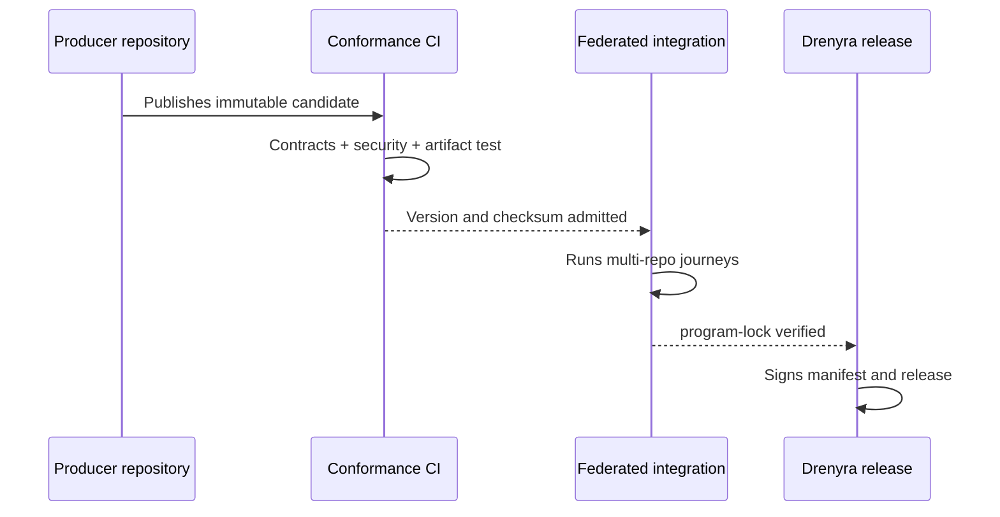
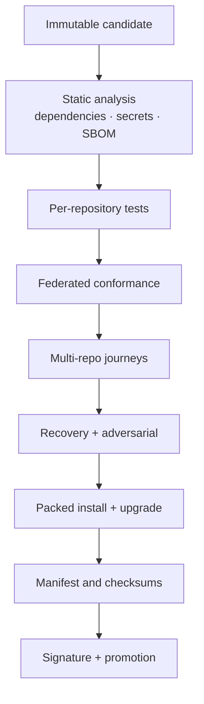

# Release Train — Drenyra Dominion Program

> Status: DRAFT (v0.1) · Source: Design 3 of the program brief
> The ecosystem releases as one reproducible composition, never as six
> `main` branches taken at different moments.

## 1. Federated release train

## 2. Immutable candidates, no distributed transaction

There is no impossible-to-recover distributed Git transaction. Coordination
happens through immutable candidates:

1. The producer publishes a candidate version.
2. Consumers run contract tests.
3. The integration runner fixes the SHAs and versions.
4. E2E journeys validate the composition.
5. Only then is the ecosystem manifest promoted.

Every consumer uses the promoted artifact, never a copy of `main`.

## 3. Release pipeline

## 4. `program-lock.json` — the reproducible composition

Each integrated checkpoint fixes exactly:

- Repository.
- Commit SHA.
- Package version.
- Contracts consumed and produced.
- Skills and policies included.
- Storage schemas.
- MCP/SDK compatibility.
- Conformance test status.
- Artifacts and checksums.

"Drenyra v0.x" is therefore a reproducible composition of the ecosystem.

## 5. Waves

| Wave | SDDs | Verifiable outcome |
| --- | --- | --- |
| 0 — Constitution | 000–010 | Authority, contracts, multi-repo compatibility |
| 1 — Universal runtime | 020–040 | Configured hosts, organic routes, transactional RDA |
| 2 — Fiscal intelligence | 070–090 | Verifiable skills, bounded memory, independent Guardian |
| 3 — Flagship product | 050–060–100 | Monthly close for firms and internal teams via Web UI |
| 4 — Production | 110 | Real connectors, KMS, observability, pilots, commercial operation |

Wave 3 depends on wave 2 capabilities; its UX exploration may advance earlier,
but authoritative implementation may not.

## 6. Implementation and delivery policy

- Strict TDD mandatory.
- Initial max 400 authored lines per review unit.
- Larger changes delivered via chained PRs; each PR produces a verifiable
  capability, never an incomplete layer.
- Feature branch + mandatory human review.
- Receipts over the exact candidate delivered.
- The tracker integrates branches in dependency order.
- Rollback in reverse order without rewriting historical receipts.
- Frozen contracts do not change inside an ordinary implementation PR.

## 7. Rollback

- Per-vertical rollback: revert the vertical's PR chain in reverse dependency
  order.
- Historical receipts are never rewritten.
- A rollback returns the ecosystem to the previous `program-lock` composition,
  then revalidates conformance.

## 8. Program gates

An SDD cannot advance if it contradicts the authority model, duplicates a
normative function, lacks a producer–consumer contract, depends on a moving
branch, breaks frozen conformance, introduces floats, uses memory as evidence,
adds external execution without UNKNOWN reconciliation, lacks migration/rollback,
exceeds review budget without splitting, or declares mock-proven work complete.
